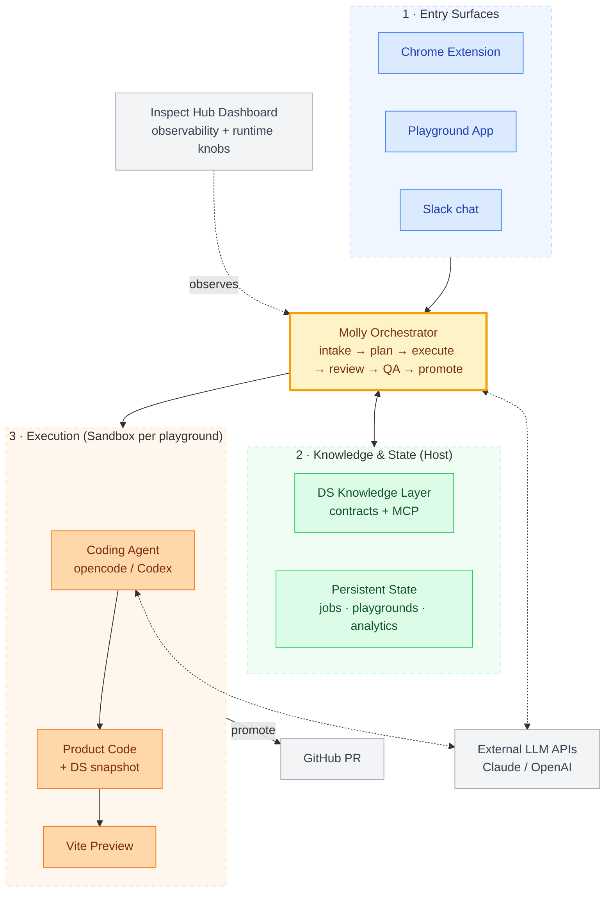
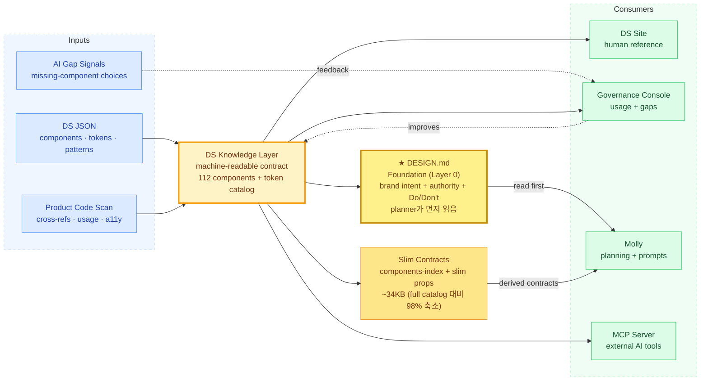

# Moloco Inspect — Progress Update & Direction (May 2026, 한국어 버전)

> **청중:** VP Product, AI Experiences and Transformation + 프로덕트 디자이너
> **미팅:** Design Tooling (30분)
> **사전 공유일:** 2026년 5월 13일
> **작성자:** 하경재
>
> *영어 원본: [`2026-05-13-inspect-overview.md`](./2026-05-13-inspect-overview.md) — 미팅에 사용되는 문서. 본 한국어 버전은 작성자 개인 참고용.*

---

## Executive Framing — 미팅 전 핵심 요약

### 왜 이것이 Slingshot에 의미가 있는가
Design Tooling으로 시작한 이 작업이 Slingshot의 여러 워크스트림과 정렬되는 두 가지 패턴을 만들어냈습니다 — **AI 에이전트를 위한 machine-readable knowledge layer**로 진화한 디자인 시스템, 그리고 디자인에 종속되지 않은 **일반화 가능한 multi-agent orchestration 패턴 (Molly)**. 둘 다 작동하는 reference implementation입니다 — Speedboat 스킬, governance case study, 다른 도메인의 contract template으로 추출 가능합니다.

### 예상치 못하게 발견된 것
- **디자인 시스템은 AI knowledge layer다** — documentation site가 아니라 structured contract가 LLM을 도메인에서 유용하게 만듭니다.
- **Orchestration 패턴은 도메인 독립적이다** — plan → gate → execute → review → QA → gate → promote는 UI뿐 아니라 어떤 system-of-record 변경에도 작동합니다.
- **Governance는 designed-in이지 bolted-on이 아니다** — sandbox 격리, 두 human gate, escalation sink, governance 콘솔 — 모두 시스템과 함께 만들어진 design decision.

### 이미 작동 중인 것
- Phase 1 파이프라인 end-to-end 작동 (계획 70일, 실제 18일).
- 세 role-specific entry surface (Chrome extension, Playground, Slack)가 공유 orchestrator 위에서 작동.
- DS knowledge layer: 컴포넌트 112개, 13개 카테고리 토큰 catalog, cross-reference와 usage telemetry가 ~3.6K TS/TSX 소스 파일에서 자동 추출됨.
- Governance 콘솔 라이브 (usage insights + anomaly 알림 + 세 entry surface 공유 sink for unresolved-component 선택).
- MCP server: 어떤 AI 도구(Claude Code, Cursor)든 같은 지식 쿼리 가능.
- 비용 예측 가능 (PoC 약 $50–100/month).

### 아직 불확실한 것
- **Trial signal** — Small-team trial이 이번 주 시작; 첫 실사용 데이터가 Phase 2 gating event.
- **Scale** — Governance와 비용이 5+ concurrent 사용자에서 아직 stress-test 안 됨.
- **Generalization** — 패턴이 UI 외 도메인에서도 *작동해야* 하지만, 아직 테스트 안 됨.
- **Closed-loop self-improvement** — 비전에 필요한 data infrastructure가 아직 구축 안 됨.

### 논의가 필요한 것
1. **Sequencing trade-off.** Phase 2 작업 (external integration, evaluator separation, deploy)과 Slingshot 통합이 다음 분기에 둘 다 pull이 있음. 올바른 trade-off는 어디?
2. **두 번째 인스턴스 candidate 도메인.** 패턴이 일반화한다면, 다음 도메인 (데이터, QA, 백엔드, admin tooling, Client Experience)의 선택이 abstract argument보다 더 중요.
3. **디자인 팀이 어디에 looped in되어야 하나.** 에이전트가 routine 변경을 처리할 때, 디자인 팀이 어디에 더 빨리 looped in되고 싶나 — pattern 진화, anti-pattern 단속, UX writing 톤 — vs 어디서는 routine 작업에서 unblock되는 게 반가운가?

전체 architecture, pipeline, risks, timeline은 아래 appendix 참조.

---

# Appendix — Architecture, Pipeline, Risks, and Timeline

## TL;DR

이 작업은 Design Tooling으로 시작했습니다 — PM, SA, 엔지니어가 자연어로 라이브 제품 UI를 수정할 수 있도록 하는, 디자이너 없이 진행 가능한 시스템입니다. 7주가 지난 지금 Phase 1 파이프라인이 end-to-end로 작동하고 있고 (계획 70일, 실제 18일), 두 가지 주목할 만한 방향으로 작업이 확장되었습니다:

1. Design System이 컴포넌트 라이브러리에서 **AI 에이전트가 추론하는 machine-readable knowledge layer**로 진화했습니다 — 컴포넌트, 토큰, anti-pattern, cross-reference, usage telemetry 모두 LLM이 navigate할 수 있는 구조화된 artifact가 되었습니다.
2. UI 변경의 뒷단에서 작동하는 orchestrator가 **일반화 가능한 multi-agent 패턴 (Molly)**으로 자랐습니다 — plan, decompose, execute, review, gate, promote — 이 패턴은 디자인에 종속되지 않고 다른 도메인 (데이터, QA, 백엔드 변경)에도 적용 가능합니다.

이 둘이 Slingshot의 여러 워크스트림과 — Agentic Platform, AI Governance, High-Value Workflows, AI Proficiency & Enablement — 논의할 만한 방식으로 교차합니다.

**미팅에서 논의할 세 thread:** (a) Phase 2 깊이와 Slingshot 통합의 sequencing trade-off, (b) 이 패턴의 두 번째 인스턴스로 가장 적합한 도메인, (c) 디자인 팀이 어디에 더 빨리 looped in되어야 하고 어디서는 routine work에서 unblock되어야 하는지.

---

## 1. 배경과 시작점

**왜 이것이 존재하는가.** Moloco의 프론트엔드 UI 변경은 익숙한 병목을 따릅니다: PM/SA가 변경을 설명 → 디자이너가 mock → 엔지니어가 구현 → 리뷰. 작은 변경 ("컬럼 추가", "문구 수정")조차 며칠씩 걸립니다. 전제는 단순했습니다 — AI가 디자인 시스템을 충분히 알면, PM/SA가 직접 변경을 자연어로 설명하고, 작동하는 미리보기를 보고, PR을 만들 수 있어야 합니다. 작은 변경에 한해서는 디자이너가 개입할 필요가 없어야 합니다.

**원래 계획.** Phase 1 (파이프라인 + PoC), Phase 2 (채널 확장 + 배포), Phase 3 (자체 품질 관리). Phase 1은 10주, PoC까지 70일.

**실제로 일어난 일.** Phase 1 코어가 약 18일에 완성되었습니다. Phase 2–3 에 예정되어 있던 여러 기능 (Chrome extension, auto-refinement loop, documentation site, dashboard, MCP server)이 Phase 1 안에서 출시되었습니다. 그 이후 4주는 디자인 시스템을 ontology로 확장하고, Molly의 multi-agent 패턴을 만들고, small-team trial을 준비하는 데 썼습니다.

**상태 (2026-05-13).** End-to-end로 작동 중. 지금까지는 solo build였고, small-team trial이 다음 주에 첫 외부 사용자를 받습니다 (trial 형식은 미정). Phase 2 (external integration, evaluator separation, deploy)는 5월 말 시작.

**현재 vs 목표.** 디자이너 중재 플로우로는 컬럼 추가나 카피 수정 같은 작은 UI 변경에 1–3일이 걸립니다. PoC에서는 같은 모양의 변경이 첫 메시지에서 엔지니어 리뷰 ready PR까지 5분 미만으로 완료되었습니다. Trial은 그 결과가 통제 조건 밖에서도 유지되는지 측정합니다.

---

## 2. 시스템 아키텍처

세 개의 진입점, 하나의 orchestrator, playground마다 격리된 sandbox 하나.



**컴포넌트 역할.**

- **Surfaces (Chrome extension / Playground / Slack)** — 같은 파이프라인으로 들어가는 role-specific 진입점. 각 surface는 서로 다른 cognitive mode (in-flow visual / deep-work canvas / casual async)에 최적화되어 있습니다.
- **Molly** — orchestrator. 세 surface가 모두 talk to하는 단일 Node 서비스. Job state machine을 돌리고, plan을 emit하고, 각 task를 review와 QA에 라우팅합니다. 모든 상태 전이는 디스크에 영속화 — Molly가 죽었다 살아나도 in-progress job은 손실 없이 복원됩니다.
- **Sandbox** — 플레이그라운드당 Docker 컨테이너 한 개. 안에 Vite dev 서버 + 제품 repo의 git working tree + coding agent. 호스트 repo는 절대 수정되지 않습니다.
- **Coding agent** — sandbox 안에서 작동하는 opencode 또는 Codex. task별 prompt + DS context를 받아 코드를 수정하고 commit합니다.
- **DS knowledge layer** — 모든 컴포넌트의 구조화된 contract (JSON), 토큰, pattern, cross-reference, usage statistics. Planning과 execution 시점에 agent에게 서비스되고, MCP server를 통해 다른 AI 도구에도 제공됩니다.
- **Inspect Hub Dashboard** — job 추적, diff 리뷰, Molly metrics, 런타임 knob을 위한 operational 콘솔.

**두 개의 human gate.** LLM이 plan을 emit한 뒤 사람이 승인해야 합니다. 자동 QA 후에 사람이 QA pass를 확인해야 합니다. 자동 검증은 신호를 제공하지만, gate 역할은 사람의 확인만 합니다.

**Gate가 향하는 곳 — closed-loop vision.** 두 human gate는 단순 안전장치가 아니라 신호 수집점이기도 합니다. 모든 plan 수정, 모든 reject, 모든 QA 결과, 모든 코멘트 핀이 agent의 추론이 어디서 개선되어야 하는지에 대한 구조화된 피드백입니다. 중기 목표는 이 루프를 닫는 것입니다 — 수집된 신호를 planner와 reviewer로 다시 흘려보내 agent가 사람이 lesson을 명시적으로 articulate하지 않아도 스스로 개선되도록. *이를 안정적으로 하기 위한 data infrastructure는 아직 구축되지 않았습니다 — 지금은 신호 수집 단계이고, 루프는 열려 있습니다.* 루프가 닫히면, gate는 유지되지만 사람의 역할이 routine mistake 교정에서 진짜 ambiguous한 case의 adjudication으로 옮겨갑니다.

**구체적으로 "self-improvement"는 무엇을 의미하는가.** 단기 접근은 시스템 레벨입니다 — 반복되는 failure mode에 맞춘 prompt engineering, 수집된 plan-edit과 review 신호 위의 RAG, agent가 같은 anti-pattern에 반복적으로 걸릴 때 contract 추가. 모델 레벨 fine-tuning (supervised, 또는 신호가 뒷받침된다면 preference-pair / RLHF-style)은 장기 단계입니다 — 신호 볼륨과 함께 fine-tune 비용 vs prompt-cache 경제성에 대한 별도 판단이 필요합니다.

**배포 형태.** 현재는 orchestrator와 sandbox 모두 개발자의 로컬 머신에서 작동합니다 (macOS 위 Docker). 현재 capacity ceiling은 동시 1–2 사용자. 다음 배포 단계는 — small-team trial이 충분한 신호를 주면 — 두 레이어 모두를 GCP로 옮기는 것입니다. 이렇게 하면 ceiling이 약 5–20 concurrent 사용자로 올라가고, 개발자 노트북 의존성이 사라집니다. 위 다이어그램의 아키텍처는 바뀌지 않습니다 — 호스트만 바뀝니다.

---

## 3. Design System — 컴포넌트 라이브러리에서 AI Knowledge Layer로

디자인 시스템은 documentation site (컴포넌트 브라우저 with 미리보기, anatomy, 토큰, accessibility spec)로 시작해 구조화된 machine-readable knowledge graph로 자랐습니다.

**현재 contract에 무엇이 들어있는가.**

```
MCButton2
├── Category: Action
├── Variants: primary, secondary, ghost, danger
├── Props: label, onClick, disabled, loading, icon, size
├── Token references (resolved against the central token catalog):
│   ├── background → semantic.action.primary
│   ├── text       → semantic.text.inverse
│   └── radius     → radius.md
├── States: default, hover, active, disabled, loading
├── Accessibility: role, aria-disabled, keyboard behavior
├── Anti-patterns: documented in natural language
├── Cross-references:
│   ├── usedInPatterns:     ["ConfirmDialog", "FormFooter"]
│   ├── relatedComponents:  ["MCIconButton", "MCButtonGroup"]
│   └── requiredProviders:  ["MCThemeProvider"]
├── Usage stats: file_count, instance_count, stability tier
└── Documentation: rendered as the public DS site
```

현재: 컴포넌트 112개와 13개 top-level 카테고리 (color, spacing, typography, elevation, animation, dark mode 등)로 구성된 토큰 catalog. Cross-reference와 usage telemetry는 ~3.6K TS/TSX 소스 파일을 scan하여 자동 추출됩니다 (추출 파이프라인은 지난 주에 라이브됨).



**왜 이것이 AI에 중요한가.** Contract가 없으면 agent는 컴포넌트 이름을 지어내고, 16진수 색상을 하드코딩하고, prop을 추측합니다. Contract가 있으면 agent는 실제 이름 (`MCButton2`)을 쓰고, 토큰 (`semantic.action.primary`)을 참조하고, 실제 prop API를 따르고, 올바른 ARIA 속성을 포함하고, 문서화된 anti-pattern을 존중합니다. 이것이 "AI knowledge layer"라는 주장의 구체적 모습입니다.

**Foundation layer + slim contracts (2026-05-17~18 추가).** 풀 machine-readable contract (~500KB)는 documentation site / governance 콘솔 / MCP server의 single source of truth로 남습니다. Molly planner에 inject 되는 시점에 orchestrator는 지식을 두 역할로 분리합니다:

- **Foundation (Layer 0): `DESIGN.md`** — planner가 먼저 읽음. ~11KB markdown 으로 brand identity, authority hierarchy ("출처가 충돌하면 위쪽이 우선"), 16-category 컴포넌트 인덱스 (name only), design-token 요약, Do's & Don'ts, living-document 정책 포함. SYSTEM_PROMPT가 planner에게 "DESIGN.md를 먼저 읽으라"고 명시 — CLAUDE.md / progressive-disclosure foundation 패턴 (always-on, 나머지를 framing).
- **파생된 slim contracts** — `components-index.json` (~22KB; name, importStatement, category, status 만) + slimmed `component-props.json` (description + 메타 제거, `| undefined` 제거; ~200KB → ~100KB). `patterns.json`, `api-ui-contracts.json`, `pm-sa-request-schema.json` 은 그대로 통과.

컴포넌트별 `when_to_use` / `do_not_use` / `antiPatterns` 는 planner system block 에서 *제외*되고, planner가 불확실할 때만 escalation 흐름 (`closest_match` / `unresolved_components`)으로 도달합니다. Full contract 는 그대로 유지 — slim view는 prompt cache 비용 최적화를 위한 파생 view입니다.

측정 결과 (paired smoke, 2 PRDs): cold start system token **237K → 112K (−52.6%)**, plan latency **−10% to −21%**, plan 품질 유지 또는 약간 풍부 (referenced_components 5 → 6–7, escalation 흐름 정상 작동, hallucinated 컴포넌트 이름 없음). Foundation order로 재배치 (2026-05-18) 시 cache token 영향 ~+0.05% (측정 noise 범위). Sonnet cache rate 기준 plan emit 1회당 약 $0.35 절감.

**Contract는 누가 유지하고, drift는 어떻게 잡히는가.** Contract는 두 ownership layer로 나뉩니다. 자동 추출 필드는 product 코드를 스캔할 때마다 rebuild되어 코드와 drift할 수 없습니다 — props는 ts-morph로 TypeScript 타입에서 직접 추출되고, cross-reference와 usage telemetry는 ~3.6K 파일의 코드베이스 스캔에서 얻습니다. 디자인 팀이 작성하는 필드 (variants, anti-pattern, accessibility behavior, UX writing rule)는 JSON으로 존재하며 governance console에서 anomaly 알림으로 리뷰됩니다 — 예를 들어 stable로 표시되었지만 zero usage인 컴포넌트는 표시됩니다. Drift 검사 스크립트 (`prop-check`, `sync-check`)는 로컬에 존재하며, 다음 governance 단계는 이들을 CI gate로 연결하는 것입니다.

**Measurement-improvement 루프를 위한 두 콘솔.**

디자인 시스템은 정적 문서가 아닙니다. 두 operational surface가 디자인 시스템이 적응하고 개선되는 과정을 지켜봅니다:

1. **DS documentation site** — 사람용 reference. Interactive prop control, anatomy 다이어그램, 토큰 표, accessibility spec, 5개 언어의 syntax-highlighted 코드, global search, dark mode.

2. **DS Governance console** (같은 사이트의 별도 페이지) — improvement 루프. Usage insights는 라이브 (컴포넌트별 file count, "stable이지만 zero usage" 같은 anomaly 알림). AI가 contract에 없는 컴포넌트를 요청하면, 그 선택이 세 개 entry surface (Extension, Playground, Slack) 전체에서 공유되는 sink에 로그되고, silent failure하지 않고 다음 governance view를 위해 큐잉됩니다.

**Inspect Hub Dashboard**는 이를 orchestration 측면에서 보완합니다: job metric, review pass rate, QA 결과, per-job 상태, 런타임 knob. 두 콘솔이 함께 작동해서 *DS가 사용 중에 어떻게 보이는가*와 *AI가 그것에 대해 얼마나 잘 작동하는가*를 모두 측정합니다.

**MCP server.** Model Context Protocol을 말하는 모든 AI 도구 — Claude Code, Cursor, 향후 회사가 채택할 어떤 agent든 — 같은 지식을 쿼리할 수 있습니다: 컴포넌트 lookup, 토큰 resolution, pattern 추천. DS knowledge layer는 이 파이프라인뿐 아니라 플랫폼의 모든 agent가 consume할 수 있습니다.

---

## 4. Molly — UI 변경 뒤의 Multi-Agent 패턴

디자인 시스템이 knowledge layer라면, Molly는 그것을 사용하는 orchestrator입니다 — 세 surface가 모두 talk to하는 단일 서비스. 실행 중인 서비스를 넘어, Molly는 *패턴*이기도 합니다 — plan, decompose, execute, review, gate, promote — 그 패턴이 PRD나 한 줄 요청을 reviewable PR로 바꿉니다.

**파이프라인, 단계별로.**

1. **Intake.** 사용자가 어떤 surface에서든 변경을 설명합니다. History-aware하고 multi-turn — 시스템이 clarifying question을 던지고, 첨부 context (PRD, 스크린샷)를 받고, intent (chat / plan / status / clarify)별로 라우팅합니다.
2. **Plan emission + human gate.** Sonnet planner가 요청 + DS context를 읽고 구조화된 plan을 emit합니다 (tasks, target route, referenced components, unresolved components). DS context 는 foundation-first 패턴을 따릅니다 (§3 참조) — `DESIGN.md`가 SYSTEM_PROMPT 직후로 inject되어 나머지 slim contracts (components-index, slim component-props, patterns, api-ui-contracts)를 framing합니다. 응축 전 ~237K cache tokens 대비 ~112K. 정적 prefix는 비용 예측 가능성을 위해 1시간 prompt cache를 사용합니다. 사용자가 plan을 승인/수정/거절해야 어떤 것도 실행되지 않습니다.
3. **Decompose and execute.** Plan은 atomic task로 쪼개지고, 각 task는 단일 agent 호출로 git commit 하나를 만듭니다. Coding agent는 sandbox 안에서 DS context와 (선택적으로) 병렬 read-only agent가 모은 pre-flight research bundle을 받아 작동합니다.
4. **Per-task review + QA.** Claude가 각 diff를 task 설명에 대해 review (pass / fail)하고, 변경의 모양에 맞는 QA 전략 (`final_route_smoke`, `lint_only`, `human_only` 등)을 골라 sandbox에서 실행합니다.
5. **Human QA gate → promote.** 자동 QA가 통과해도 사람이 명시적으로 확인해야 job이 `complete`이 됩니다. Promote는 실제 제품 repo에 PR을 엽니다.

**무엇이 이를 generalizable하게 만드는가.**

- 단계 1–5 어디에도 디자인-specific한 것이 없습니다. 이 모양은 사용자가 AI 에이전트에게 system of record에 통제된 review된 변경을 만들게 하고 싶은 어떤 도메인에도 작동합니다: 데이터 파이프라인 수정, QA 테스트 작성, 백엔드 핸들러 변경, 인프라 설정 변경.
- 두 human gate와 sandbox 격리는 도메인 중립적인 governance primitive입니다.
- DS knowledge layer는 더 일반적인 패턴의 특수 사례입니다 — 도메인에 대한 구조화된 machine-readable contract. 다른 도메인에는 그들 나름의 contract가 있습니다 — 데이터의 entity schema, 백엔드의 API contract, QA의 test scaffolding library. 새 도메인은 자체 contract와 adapter가 필요하고, orchestrator primitive는 재사용 가능합니다.

---

## 5. Surface와 Use Case

세 surface가 하나의 orchestrator와 하나의 intake protocol을 공유합니다. 핵심은 UI가 세 개라는 것이 아니라, **사용자가 이미 있는 어떤 context에서든 같은 파이프라인에 도달할 수 있다**는 것입니다.

| Surface | Primary user | Work context | 전형적 use case |
|---|---|---|---|
| **Chrome Extension** | PM, SA | In-flow, visual | 라이브 제품 페이지를 inspect하고, 정확한 요소를 클릭하고, 한 줄로 변경을 설명. *"이 테이블에 Used Amount 컬럼 추가해줘."* |
| **Playground App** | PM, SA, designer, engineer | 깊은 작업 | PRD 사이즈의 multi-task plan, plan 편집, 미리보기에 코멘트 핀, iterative refinement. |
| **Slack** | 누구나 | Casual, async | 한 번씩 *"@molly please update the empty-state copy on the X page"* 식의 요청; thread 기반 clarification; 결과는 PR 링크로 전달. |

Role-specificity는 진짜입니다. 미팅 중인 PM은 뭔가를 가리키며 설명하고 싶습니다 (Chrome extension). PRD를 쓰는 PM은 시간을 두고 다듬을 캔버스를 원합니다 (Playground). 작은 요청이 있는 엔지니어/분석가는 별도 도구를 열고 싶지 않습니다 (Slack). 같은 orchestrator가 세 가지를 모두 처리합니다 — intake protocol이 공유되기 때문입니다.

**Figma에 관한 노트.** 조직은 디자인 시스템을 위한 Figma 라이브러리를 유지하지만, 시간이 지나면서 코드베이스와 동기화를 잃었습니다. *Code-grounded한 컴포넌트 레벨 변경*에 한해, operational source of truth는 이제 DS contract + 모든 plan이 만드는 라이브 미리보기입니다. Figma는 early ideation, net-new pattern, contract가 존재하기 전의 design-first exploration에 여전히 valuable합니다. 바뀐 것은 committed된 컴포넌트 레벨 작업의 경로입니다 — mock이 아닌 contract에 grounding됩니다. Figma가 팀에게 수행하던 세 가지 operational 역할은 code-grounded 작업에 한해 Playground가 흡수합니다:

- *변경의 시각적 확인* — 모든 plan이 실제 제품 코드 위에서 작동하는 라이브 미리보기를 만들어냅니다. Mock이 아닙니다.
- *옵션을 펼쳐놓고 탐색하기* — 대안 plan들을 side-by-side로 열고 실제 라우트 위에서 비교할 수 있습니다.
- *특정 디자인에 anchor된 팀 커뮤니케이션* — 작동 중인 미리보기에 코멘트 핀, 그리고 어떤 팀원이든 같은 상태를 열고 context 안에서 대화를 이어갈 수 있는 공유 가능한 playground 링크.

Net-new pattern, 초기 단계 exploration, 디자인 시스템 진화는 여전히 Figma에 있습니다. 바뀐 것은 committed된 컴포넌트 레벨 변경의 final-mile 경로뿐입니다 — 그 경로가 이제 contract와 라이브 미리보기에 grounding되어, mock과 shipped code 사이의 historical drift gap을 닫습니다.

**Comment 채널.** Design-direction 코멘트는 ideation을 위해 Figma에 남습니다. Committed된 변경에 대한 컴포넌트 레벨 피드백은 정적 mock이 아니라 실행 중인 미리보기 위의 Playground pin에 남습니다. 이 split은 의도된 것입니다 — Figma에서는 divergent ideation, 실제 route 위에서는 convergent review.

---

## 6. Reframe — 이 작업이 실제로 만들어낸 것

명시할 가치가 있는 세 가지 인사이트가 떠올랐습니다. 각각은 디자인을 위해 만든 것의 일반화지만, 더 넓게 적용됩니다.

**Insight 1 — 디자인 시스템은 AI knowledge layer다.**
구조화된 contract가 — documentation site가 아니라 — LLM을 도메인에서 유용하게 만듭니다. 그것이 없으면 모든 agent가 같은 잘못된 가정을 다시 발명합니다. 있으면 agent가 실제 이름, 실제 API, 실제 anti-pattern 위에서 추론합니다.

**Insight 2 — Orchestration 패턴은 도메인 독립적이다.**
Plan → human gate → decompose → execute → review → QA → human gate → promote는 일반적 모양입니다. Sandbox + git + LLM-review primitive는 디자인-specific하지 않습니다. AI가 system of record에 통제된 변경을 만드는 어떤 도메인이든 이 모양을 쓸 수 있습니다. 공유 intake protocol — 같은 파이프라인을 Slack, extension, Playground 어디서든 도달 가능하게 만드는 부분 — 이 protocol이 안정화되면 새 surface 추가 비용을 작게 만듭니다.

**Insight 3 — Governance는 day one부터 designed in되어 있다.**
두 human gate, sandbox 격리, escalation sink, governance 콘솔, 측정된 기본값을 가진 런타임 knob — 모두 시스템과 함께 만들어진 design decision이지 사후 추가가 아닙니다. 처음부터 하는 비용은 modest했습니다. 사후에 하는 비용은 높고, 일부 경우에는 회복 불가능했을 것입니다. Governance는 아직 스케일에서 stress-test된 적이 없습니다 — 그것이 trial이 측정할 것이며 현재의 주장은 아닙니다.

---

## 7. Slingshot과의 정렬

Slingshot의 네 워크스트림은 Inspect 작업이 이미 수행한 capability와 가깝게 매핑됩니다.

**Slingshot 1 — Agentic Platform (Speedboat as one-stop shop).**
Molly는 LLM 위에서의 multi-agent orchestration의 작동하는 reference implementation입니다 — planner, executor, reviewer, QA strategist, 그리고 이들을 묶는 primitive. Pattern들 (intake protocol, plan-approve-execute-gate, sandbox per playground, MCP-served knowledge layer)은 skill 및 plugin으로 추출 가능하며 Speedboat에 contribute할 수 있습니다. DS MCP server 자체가 candidate plugin입니다 — Speedboat 위 어떤 agent든 같은 protocol로 디자인 시스템 지식을 쿼리할 수 있습니다.

**Slingshot 2 — AI Governance (가드레일, 환경, 프로세스).**
이미 운영 중인 조각들:

- Playground별 sandbox 격리 (호스트 코드 절대 안 건드림)
- 두 human gate (plan 승인 + QA pass)
- 세 entry surface에서 unresolved-component 선택을 기록하는 공유 sink (silent drop 없이 다음 governance view로 큐잉)
- 라이브 usage insights와 anomaly 알림이 있는 governance 콘솔
- 측정된 기본값과 함께하는 명시적 런타임 knob
- Auditability를 위해 디스크에 영속화되는 per-job 상태

Governance 워크스트림의 구체적 case study — 다만 대부분의 조각이 아직 trial에서 stress-test 중입니다.

**Slingshot 3 — High-Value Workflows (function 레벨 임팩트).**
PM/SA UI-change 워크플로우는 깔끔한 high-value 워크플로우입니다 — well-bounded task, 측정 가능한 cycle time delta (designer-mediated 며칠 → minutes-to-PR), 측정 가능한 quality (TypeScript check, lint, QA strategy, engineer review pass rate). 인접 워크플로우의 beachhead이기도 합니다 — copy/UX writing, accessibility audit, layout polishing — 모두 같은 파이프라인 모양을 공유합니다.

**Slingshot 4 — AI Proficiency & Enablement (role-specific learning journey).**
세 surface가 이미 role-specific 진입점입니다. DS 사이트는 learning artifact로도 작동합니다 — 디자인 시스템에 처음 접하는 사람이 interactive하게 browse할 수 있습니다. Playground 자체가 teaching tool입니다 — 사용자가 agent의 plan을 보고, 단계별 실행을 watch하고, diff를 보고, QA 결과를 봅니다.

---

## 8. 이것이 어디로 갈 수 있는가

논의할 만큼 구체적으로 느껴지는 세 방향.

**(a) 다른 product로.** DS contract가 있는 어떤 product repo에든 같은 파이프라인을 가져다 댈 수 있습니다. Marginal 비용은 one-time contract extraction.

**(b) 다른 도메인으로 (다음 logical experiment).** Orchestration 패턴은 UI 코드에 묶이지 않습니다 — 다만 아직 비-UI 도메인에 파이프라인을 적용해보지 않았습니다. 같은 모양에 맞는 후보:

- **데이터 파이프라인 변경** — entity schema + transformation logic. "DS contract"가 entity catalog가 됩니다.
- **QA 테스트 작성** — test pattern + assertion library.
- **백엔드 핸들러 수정** — API contract + service boundary (OpenAPI + service catalog).
- **내부 도구 / admin UI** — CRUD pattern.

각각 자기 도메인 contract + adapter (sandbox, QA, promotion path)가 필요합니다 — orchestrator, planning, review, gating primitive는 그들 사이에서 재사용 가능합니다.

그리고 리스크 프로파일은 도메인별로 다릅니다 — UI 변경은 가시적으로 실패하는 경향이 있는 반면 백엔드나 데이터 변경은 silent하게 실패할 수 있습니다. 각 adapter는 그에 맞춰 QA 강도를 보정합니다: UI는 automated check + human visual confirmation을 사용하고, 백엔드/데이터 adapter는 그 위에 integration test, performance assertion, data-quality gate가 추가로 필요합니다.

**(c) Speedboat 기여로.** Intake protocol, plan-execute-review-gate 패턴, sandbox primitive, MCP-served knowledge layer — 각각 Speedboat의 skill 또는 plugin으로 패키징될 후보입니다.

---

## 9. 리스크와 미해결 문제

아직 해결되지 않은 것들을 명시합니다.

- **스케일에서의 API 비용.** PoC 비용 약 $50–100/month, Phase 2 추정 약 $200–400/month (small-team scale). Per-request parallelism 비용은 측정됨 (P=1–5 sweep, 여기서 P는 task별 pre-flight context agent 수)으로 defensible 기본값 (P=5)이 있음. 5명 이상 concurrent 사용자에서의 비용은 아직 미측정.
- **Multi-page 일관성.** Agent는 page별로 작동합니다. Cross-page 작업 ("이 개념을 모든 곳에서 rename")은 아직 first-class가 아닙니다. Phase 2에 계획됨.
- **PRD 파싱 정확도.** 팀마다 포맷이 다양하고, 비표준 입력에서 파싱이 degrade됩니다. Phase 2 sub-item.
- **Coverage gap.** Shared-component 레이어는 커버리지가 높음. msm-portal의 1,320개 app-level 파일은 구조화된 contract가 없음 — agent가 보긴 하지만 같은 추론력을 발휘하지는 못함. 점진적으로 처리 중이며, full coverage는 long-term 작업.
- **Governance edge case.** 현재 escalation은 missing 컴포넌트는 처리하지만, 더 미묘한 case (컴포넌트가 의도된 패턴 밖에서 사용됨, agent가 인식 못 하는 anti-pattern violation)는 아직 처리 안 됨. Follow-up 작업이 scoped이지만 아직 미구축.
- **Concurrent code writing.** 현재 parallelism은 *context*를 병렬로 모음. *Code*를 task 사이에서 병렬로 쓰는 것은 별개의 research-only 질문 — merge-and-conflict 비용 vs 지연 절감.
- **Rethink를 일으킬 신호:**
  - Review pass rate가 iteration 후에도 ~50% 미만으로 *지속* (초기 숫자가 낮은 건 OK — 개선되지 않는 게 문제)
  - 사용자가 첫 세션 후 dropout
  - 비용 outlier가 사용량과 trend하지 않음
  - Governance escape — 두 human gate를 통과한 anti-pattern code

---

## 10. 다음 8주

| 기간 | 초점 |
|---|---|
| **Now (W1–3)** | Small-team trial 진행, 첫 실 사용 데이터 수집. 병렬로: AI가 묻지만 아직 없는 컴포넌트에 대한 자동 DS 요청 draft / issue 생성; 병렬 pre-flight context 기능의 quality 측정. |
| **Mid-June (W4–6)** | Phase 2 시작 — 더 깊은 external integration (Slack thread, Jira ticket, 풍부한 PRD 파싱). Generator와 evaluator agent를 별도 역할로 분리해 diff를 만드는 agent와 grading하는 agent가 같지 않도록. |
| **Early July (W7–8)** | 서버 배포와 QA. 첫 내부 pilot 팀을 위한 데모와 onboarding. |

Small-team trial이 gating 이벤트입니다. 실제 PRD에 대한 실제 사용 데이터가 파이프라인이 확장될 준비가 되었는지, 통제 조건 밖에서 cost-quality trade-off가 성립하는지를 알려줍니다.

**Trial 목표** (aspirational, 아직 미측정):

| Metric | Target |
|---|---|
| 간단한 변경의 Time to PR | 첫 메시지에서 5분 미만 |
| 평균 request-to-preview 지연 | 1–3분 |
| PM 독립성 (요청에 디자이너 필요 없음) | 참가자 4 중 3 |
| DS compliance (실제 토큰과 컴포넌트 API 사용) | 80%+ |
| 첫 시도 엔지니어 리뷰 pass rate | 70%+ |
| AI-PR 당 엔지니어 리뷰 노력 | human-authored PR 기준선 이하 (no fatigue tax) |

이 목표들이 broader rollout으로 갈지, 파이프라인을 더 iterate할지의 read-out 역할을 합니다. 이것은 stretch target입니다 — 초기 read가 예를 들어 ~50% first-attempt review pass rate라면 iterate할 가치가 있는 결과이지, failure mode는 아닙니다. Rethink 트리거 (§9)는 iteration 후의 *지속적* underperformance이지, 첫 read가 아닙니다.

---

## 11. 대화를 위한 세 thread

미팅 자체로 열어둘 세 thread.

**(a) 깊이와 Slingshot 통합 사이의 trade-off.** Phase 2 작업 (external integration, evaluator separation, deploy)과 Speedboat / Slingshot 통합 둘 다 다음 분기에 meaningful한 pull을 가집니다. 올바른 trade-off는 어디에 있을까요 — Phase 2를 먼저 끝내고 Slingshot에 나중에 absorb할지, 아니면 Phase 2를 잠시 멈추고 지금 통합할지? §7의 네 워크스트림 매핑은 진짜지만, *순서 (sequencing)*는 진짜 불확실합니다.

**(b) Cross-team 두 번째 인스턴스.** Orchestration 패턴이 generalize한다면, 두 번째 도메인의 선택 (데이터, QA, 백엔드, admin tooling, 또는 다른 것)이 abstract argument보다 더 중요합니다. Contract-extraction 비용이 rate-limiter라, 다음 인스턴스를 잘 고르는 것이 high-leverage입니다. 라이브 논의가 written speculation보다 더 생산적일 것입니다.

**(c) 디자이너 involvement.** Agent가 일반적인 변경을 처리한다면, 디자인 팀이 어디에 더 빨리 looped in되고 싶어할까요 — pattern 진화, anti-pattern 단속, UX writing 톤, accessibility audit — 그리고 어디에서는 routine 작업에서 unblock되는 게 반가울까요?

---

## Next

*어떤 형태로든 follow-up 가능합니다 — 가장 자연스러운 것은 한 surface의 짧은 라이브 데모. Small-team trial이 시작하고 있고, 배우는 것을 공유하겠습니다.*
