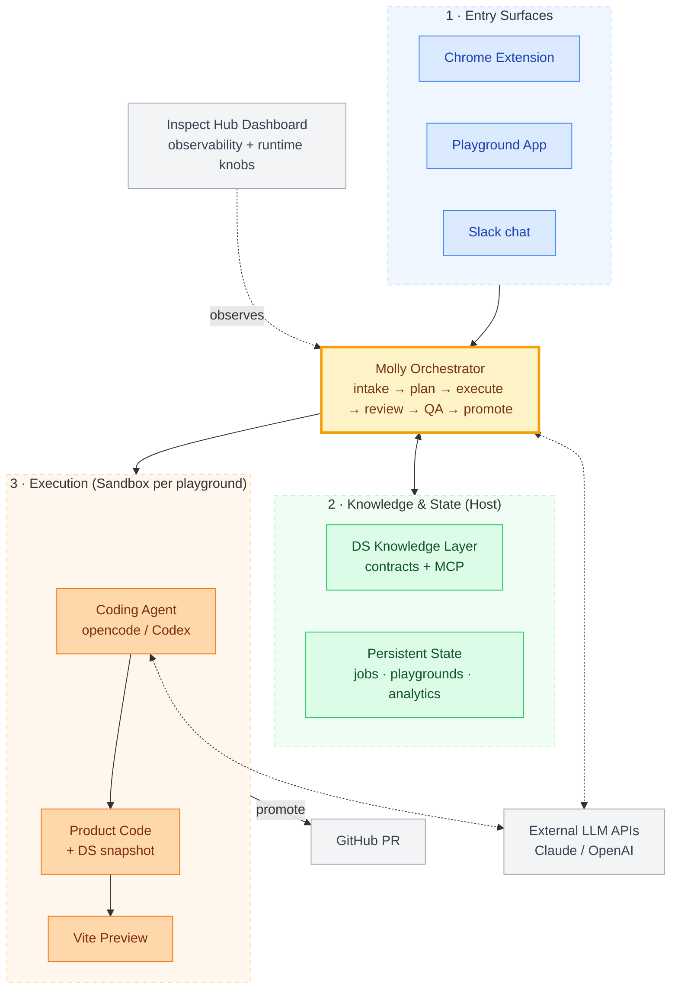
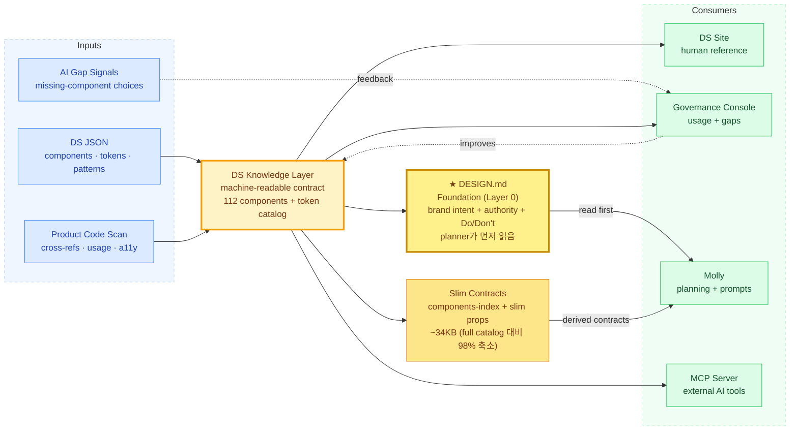
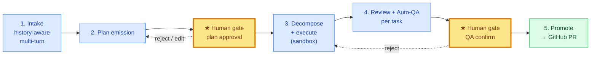

# Moloco Inspect — Overview (May 2026, 한국어 버전)

> **청중:** VP Product, AI Experiences and Transformation + 프로덕트 디자이너
> **미팅:** Design Tooling (30분)
> **사전 공유일:** 2026년 5월 13일
> **작성자:** 하경재
>
> *영어 원본: [`2026-05-13-inspect-overview.md`](./2026-05-13-inspect-overview.md) — 미팅에 사용되는 문서. 본 한국어 버전은 작성자 개인 참고용.*

---

## Executive Framing — 미팅 전 핵심 요약

### 한 줄 요약

Inspect는 PM이나 SA가 라이브 제품 UI 변경을 자연어로 설명하면 약 5분 안에 작동하는 미리보기와 엔지니어가 리뷰할 수 있는 PR을 돌려주는 시스템입니다. 디자이너를 거치면 보통 1–3일 걸리는 종류의 변경입니다.

### 어떻게 작동하는가

- **Entry.** PM/SA가 이미 있는 자리에서 변경을 설명: Chrome extension, Playground, 또는 Slack.
- **Pipeline.** Molly가 plan을 emit (사람이 승인) → sandbox 안 coding agent가 실제 제품 코드 수정 → 자동 review + QA (사람이 확인) → GitHub PR로 promote.
- **밑단.** 디자인 시스템 contract (컴포넌트 112개, 13-카테고리 토큰 catalog, 코드베이스에서 자동 추출된 cross-reference와 usage telemetry)가 agent를 실제 컴포넌트 이름, 실제 토큰, 실제 prop API에 ground시킴 (지어내지 않음).

### 지금 어디까지 와 있는가

- Phase 1 파이프라인 end-to-end 작동. 그 이후 4주는 확장 작업에 쓰임.
- 세 entry surface, 하나의 orchestrator, playground마다 격리된 sandbox 하나, 모두 라이브.
- DS knowledge layer 라이브, governance 콘솔 라이브, MCP server 라이브 (Claude Code, Cursor 같은 외부 AI 도구가 같은 지식 쿼리 가능).
- PoC 비용 약 $50–100/month.
- Small-team trial이 곧 시작. 첫 실사용 데이터도 머지않음.

### 이 작업이 어떤 원칙 위에 놓여 있는가

- **디자인 시스템 = AI knowledge layer.** LLM을 도메인에서 유용하게 만드는 것은 documentation site가 아니라 structured contract라는 가설 위에 만들었습니다.
- **도메인 독립적이 되도록 설계된 orchestration 모양 (디자인 외 미검증).** Plan → gate → execute → review → QA → gate → promote.
- **Governance는 day one부터 designed in.** Sandbox 격리, 두 human gate, escalation sink, governance 콘솔. 모두 시스템과 함께 만들어진 design decision.

### 아직 불확실한 것

- **Trial signal.** 실제 사용에서 어떻게 작동하는지가 다음 큰 gating event.
- **Scale.** Governance와 비용이 5+ concurrent 사용자에서 아직 stress-test 안 됨.
- **Generalization.** UI 외 도메인에 적용하는 것은 가설, 미검증.
- **Closed-loop self-improvement.** 방향성은 있지만 필요한 data infrastructure가 아직 구축 안 됨.

### 미팅에서 함께 얘기 나누고 싶은 것

테이블에 올려두고 싶은 세 가지 주제. 오늘 결정이 필요한 건 없습니다.

1. **MA 팀이나 MSM 팀 제품으로 이걸 한 번 해보기.** 그 제품의 DS contract를 만들고, Molly를 붙이고, 파이프라인이 그 위에서도 작동/확장하는지 본다. 이 실험이 일반화를 가설에서 사실로 옮기는 유일한 방법입니다.
2. **Slingshot과의 잠재적 접점.** 이 작업의 두 패턴 (DS as AI knowledge layer, Molly as a domain-independent orchestration shape)이 Slingshot 워크스트림과 스쳐 지나가는 느낌이 있습니다. 구체적인 제안을 드리는 건 아니고, 나중에 더 깊은 대화로 가져갈 가치가 있는지 정도를 가늠해보고 싶습니다.
3. **디자이너 역할의 진화.** Agent가 routine UI 변경을 처리하게 되면, 디자이너의 역할은 조직 전반에서 어떻게 재정의되어야 할까요? 이 미팅에서 완전히 답할 수 있는 질문보다 크겠지만, 플랫폼 관점에서의 시각이 궁금합니다.

전체 architecture, pipeline, DS 구조, risks, 8주 plan은 아래 appendix에 있습니다. 미팅 중에 특정 부분에 질문이 떠오르면 언제든 열어보시면 됩니다.

---

# Appendix — Architecture, Pipeline, Risks, and Timeline

*미팅 참고용 자료입니다. 위의 Executive Framing이 핵심 요약이며, 아래 섹션들은 미팅 중 특정 질문이 나올 때 열어보기 위한 reference입니다.*

---

## 1. 배경과 시작점

- **왜 이것이 존재하는가?** AI가 업무 환경과 개발 환경 전반에 들어온 지금, 프론트엔드 UI 워크플로우에서 디자이너 단계가 병목으로 작용하고 있습니다: PM/SA → 디자이너 mock → 엔지니어 → 리뷰는 "컬럼 추가"급 작은 변경에도 며칠씩 걸립니다. 전제: AI가 디자인 시스템을 충분히 알면 PM/SA가 직접 변경을 설명하고, 작동하는 미리보기를 보고, PR을 만들 수 있어야 합니다.
- **계획 vs 실제.** Phase 1 (파이프라인 + PoC)은 10주 / PoC까지 70일로 계획되었고, 코어는 ~18일에 완성. Phase 2–3 기능 (Chrome ext, auto-refinement, doc site, dashboard, MCP server)이 Phase 1 안에서 출시. 지난 4주: DS 확장 + Molly multi-agent + trial 준비.
- **상태.** Solo build. Phase 2 (external integration, evaluator separation, deploy) 5월 말 시작, 개발자 한 명이 합류해 도움 예정.
- **현재 vs 목표.** 디자이너 중재 플로우: 컬럼 추가나 카피 수정 같은 작은 UI 변경에 1–3일. PoC: 첫 메시지에서 엔지니어 리뷰 ready PR까지 5분 미만. Trial은 그 결과가 통제 조건 밖에서도 유지되는지 측정.

---

## 2. 시스템 아키텍처

세 개의 진입점, 하나의 orchestrator, playground마다 격리된 sandbox 하나.



**컴포넌트 역할.**

- **Surfaces (Chrome extension / Playground / Slack).** Role-specific 진입점. 각 surface가 서로 다른 cognitive mode (in-flow visual / deep-work canvas / casual async)에 최적화.
- **Molly.** Orchestrator: 세 surface가 모두 talk to하는 단일 Node 서비스. Job state machine을 돌리고 각 task를 review와 QA에 라우팅.
- **Sandbox.** 플레이그라운드당 Docker 컨테이너 한 개 (Vite dev 서버 + 제품 repo의 git working tree + coding agent). 호스트 repo는 절대 수정 안 됨.
- **Coding agent.** Sandbox 안의 opencode framework (HTTP-serve daemon, multi-provider 지원, open-source modifiability를 보고 선택, OpenAI / Anthropic 모델 사용). Task별 prompt + DS context를 받아 코드 수정, commit.
- **DS knowledge layer.** 구조화된 contract (컴포넌트, 토큰, pattern, cross-reference, usage statistics). Planning과 execution 시점에 agent에게 서비스.
- **Inspect Hub Dashboard.** Operational 콘솔: job 추적, diff 리뷰, Molly metrics, 런타임 knob.
- **두 개의 human gate.** LLM emit 후 plan 승인; 자동 QA 후 사람이 QA pass 확인. 자동 검증은 신호 제공, gate 역할은 사람의 확인만.

**Closed-loop vision (중기).** 두 human gate는 안전장치이자 신호 수집점 (plan 수정, reject, QA 결과, 코멘트 핀이 구조화된 피드백). 목표: 수집된 신호를 planner/reviewer로 다시 흘려보내 agent가 스스로 개선되도록. *이를 위한 data infrastructure는 아직 구축 안 됨. 지금은 신호 수집 단계, 루프는 열려 있음.* 구체적으로:

- **단기 (시스템 레벨):** 반복되는 failure mode에 맞춘 prompt engineering, 수집된 신호 위의 RAG, agent가 같은 anti-pattern에 걸릴 때 contract 추가.
- **장기 (모델 레벨):** Fine-tuning (supervised 또는 신호가 뒷받침되면 RLHF-style), 신호 볼륨 + fine-tune 비용 vs prompt-cache 경제성에 대한 별도 판단 필요.

**배포 형태.** 현재: orchestrator + sandbox 모두 내 로컬 맥북 (macOS 위 Docker), ceiling 1–2 사용자. 다음 단계 (trial 신호 충분히 나오면): GCP로 이전, ceiling ~5–20 concurrent 사용자. 아키텍처 불변, 호스트만 바뀜.

---

## 3. Design System — 컴포넌트 라이브러리에서 AI Knowledge Layer로

**현재 contract에 무엇이 들어있는가.**

```
MCButton2
├── Category: Action
├── Variants: primary, secondary, ghost, danger
├── Props: label, onClick, disabled, loading, icon, size
├── Token references:
│   ├── background → semantic.action.primary
│   ├── text       → semantic.text.inverse
│   └── radius     → radius.md
├── States: default, hover, active, disabled, loading
├── Accessibility: role, aria-disabled, keyboard behavior
├── Anti-patterns: documented in natural language
├── Cross-references: usedInPatterns / relatedComponents / requiredProviders
├── Usage stats: file_count, instance_count, stability tier
└── Documentation: rendered as the public DS site
```

**현재 규모.** 컴포넌트 112개와 13개 top-level 카테고리 (color, spacing, typography, elevation, animation 등)로 구성된 토큰 catalog. Cross-reference와 usage telemetry는 ~3.6K TS/TSX 소스 파일 스캔으로 자동 추출 (추출 파이프라인 지난 주 라이브).



**왜 이것이 AI에 중요한가.** Contract가 없으면 agent는 컴포넌트 이름을 지어내고, 색상을 하드코딩하고, prop을 추측. Contract가 있으면 agent는 실제 이름 (`MCButton2`), 실제 토큰, 실제 prop API, 문서화된 anti-pattern 위에서 작동. 이것이 "AI knowledge layer"라는 주장의 구체적 모습.

**Planner를 위한 두 단계 주입.** 풀 contract (~500KB)는 DS 사이트 / governance 콘솔 / MCP server의 single source of truth로 남음. Planner-time에는 orchestrator가 지식을 분리해 주입:

- **Foundation (Layer 0): `DESIGN.md`** (~11KB markdown). Brand identity, authority hierarchy, 16-category 컴포넌트 인덱스, 토큰 요약, Do's & Don'ts. Planner가 먼저 읽음. 패턴 출처: Anthropic CLAUDE.md memory 가이드 + Google Stitch DESIGN.md spec, 추가 open-source references (VoltAgent, Open CoDesign).
- **파생 slim contracts.** `components-index.json` (~22KB) + slimmed `component-props.json` (~200KB → ~100KB). 컴포넌트별 `when_to_use` / `antiPatterns`은 planner가 불확실할 때만 escalation 흐름으로 도달.
- **측정 결과** (paired smoke, 2 PRDs): cold start system token **237K → 112K (−52.6%)**, latency −10% to −21%, plan 품질 유지 또는 약간 풍부, hallucinated 컴포넌트 이름 0건. Plan emit 1회당 약 $0.35 절감.

**Contract ownership과 drift 잡기.** 두 ownership layer:

- **자동 추출** (props는 ts-morph; cross-ref + usage는 코드베이스 스캔). 매 스캔마다 rebuild; 코드와 drift 불가.
- **디자인 팀 작성** (variants, anti-pattern, accessibility, UX writing). JSON; governance console anomaly 알림으로 리뷰 (예: stable이지만 zero usage인 컴포넌트 표시).
- **Drift 검사 스크립트** (`prop-check`, `sync-check`)는 로컬에 존재. CI gate로 연결하는 것이 다음 governance 단계.

**두 콘솔 + MCP.**

- **DS documentation site.** Interactive 컴포넌트 브라우저, anatomy, 토큰, accessibility spec, syntax-highlighted 코드, global search.
- **DS Governance console.** 라이브 usage insights와 anomaly 알림. AI가 contract에 없는 컴포넌트를 요청하면 세 surface 공유 sink에 로그 (silent failure 없음). 이 큐를 governance view에 노출하는 것은 다음 단계.
- **Inspect Hub Dashboard.** Orchestration 측면: job metric, review pass rate, QA 결과, 런타임 knob.
- **MCP server.** Model Context Protocol을 말하는 어떤 도구든 (Claude Code, Cursor, 향후 agent) 같은 지식 쿼리 가능.

---

## 4. Molly — UI 변경 뒤의 Multi-Agent 패턴

Molly는 DS knowledge layer를 사용하는 orchestrator입니다: 세 surface가 모두 talk to하는 단일 서비스이자, PRD나 한 줄 요청을 reviewable PR로 바꾸는 *패턴* (plan → decompose → execute → review → gate → promote).

**파이프라인, 단계별로.**



1. **Intake.** History-aware, multi-turn. Clarifying question, 첨부 context (PRD, 스크린샷) 수용, intent (chat / plan / status / clarify)별 라우팅.
2. **Plan emission + human gate.** Planner가 요청 + DS context (foundation-first: `DESIGN.md` 먼저, 그다음 slim contracts)를 읽고 구조화된 plan을 emit. 사용자가 승인/수정/거절해야 실행됨.
3. **Decompose and execute.** Plan을 atomic task로 쪼갬, 각 task는 git commit 하나 생성. Coding agent가 sandbox 안에서 DS context와 (선택적으로) 병렬 read-only agent가 모은 pre-flight research bundle을 받아 작동.
4. **Per-task review + QA.** Reviewer가 각 diff를 task 설명에 대해 검토하고, 변경 모양에 맞는 QA 전략 (smoke test, lint-only, human-only 등)을 골라 sandbox에서 실행.
5. **Human QA gate → promote.** 사람이 확인해야 job이 `complete`. Promote는 실제 제품 repo에 PR을 엽니다.

**이것이 어디서 일반화될 수 있는가 (디자인 외 미검증).**

- 단계 1–5는 다른 system-of-record 도메인에도 *적용될 수 있는* 모양: 데이터 파이프라인, QA 테스트 작성, 백엔드 핸들러, 인프라 설정.
- 두 human gate + sandbox 격리는 도메인 중립적 governance primitive로 설계됨; UI 외 도메인에서의 적합성은 미검증.
- DS knowledge layer는 더 넓은 패턴의 특수 사례일 수 있음: 도메인에 대한 구조화된 machine-readable contract (entity schema, API contract, test scaffolding library). Orchestrator primitive가 비슷한 품질로 전이되는지는 두 번째 인스턴스 실험이 알려줄 부분.

---

## 5. Surface와 Use Case

세 surface가 하나의 orchestrator와 하나의 intake protocol을 공유합니다. 사용자가 이미 있는 어떤 context에서든 같은 파이프라인에 도달할 수 있습니다.

| Surface | Primary user | Work context | 전형적 use case |
|---|---|---|---|
| **Chrome Extension** | PM, SA | In-flow, visual | 라이브 페이지 inspect, 정확한 요소 클릭, 한 줄로 변경 설명. *"이 테이블에 Used Amount 컬럼 추가해줘."* |
| **Playground App** | PM, SA, designer, engineer | 깊은 작업 | PRD 사이즈의 multi-task plan, plan 편집, 미리보기 코멘트 핀, iterative refinement. |
| **Slack** | 누구나 | Casual, async | *"@molly please update the empty-state copy on the X page"*. Thread 기반 clarification, 결과는 PR 링크로. |

**Figma에 관한 노트.** Figma DS 라이브러리는 시간이 지나며 코드베이스와 동기화를 잃었습니다. *Code-grounded한* 컴포넌트 레벨 변경에 한해 operational source of truth는 이제 DS contract + plan이 만드는 라이브 미리보기. Figma는 early ideation, net-new pattern, contract 존재 전의 design-first exploration에 여전히 valuable. 바뀐 것은 committed된 컴포넌트 레벨 작업의 final-mile 경로뿐. 이제 contract + 라이브 미리보기에 grounding되어 mock과 shipped code 사이의 drift gap을 닫음. Playground가 Figma의 역할을 흡수:

- *변경의 시각적 확인* (shipped). 모든 plan이 mock이 아닌 실제 제품 코드 위 라이브 미리보기 생성.
- *특정 디자인에 anchor된 팀 커뮤니케이션* (shipped). 미리보기에 코멘트 핀.
- *옵션을 펼쳐놓고 탐색* (planned). 대안 plan들을 실제 라우트 위에서 side-by-side 비교.
- *Cross-team 공유* (planned). 어떤 팀원이든 열어볼 수 있는 공유 가능한 playground 링크.

---

## 6. 이 작업이 가리키는 세 가지 패턴

- **디자인 시스템은 AI knowledge layer다.** 구조화된 contract (documentation site가 아니라)가 LLM을 도메인에서 유용하게 만듦. 근거: agent가 contract에 없는 컴포넌트를 필요로 할 때 escalation flow가 깔끔하게 활성화, 생성된 코드에 실제 import 경로와 prop 이름 사용, smoke 테스트에서 hallucinated 컴포넌트 이름 0건.
- **Orchestration은 도메인 독립적일 수 있음 (디자인 외 미검증).** Plan → gate → decompose → execute → review → QA → gate → promote와 sandbox + git + LLM-review primitive는 디자인-bound가 아님. 초기 신호: UX writing 작업 (카피와 톤 변경)이 같은 파이프라인을 통해 깔끔하게 작동하고 있으며, shape가 컴포넌트 편집을 넘어 다른 종류의 변경을 처리한다는 힌트. 비-UI 도메인 (데이터, QA, 백엔드)으로의 전이는 미검증.
- **Governance는 day one부터 designed in.** 이미 존재하는 artifact: sandbox 격리, 두 human gate, 세 surface 공유 escalation sink, governance 콘솔, 측정된 기본값을 가진 런타임 knob. 처음부터 하는 비용은 저렴; 사후 retrofitting이었다면 비쌌을 것. 스케일 stress-test는 trial이 측정할 부분.

---

## 7. Slingshot과의 잠재적 접점

이 작업의 두 패턴 (DS as AI knowledge layer, Molly as a domain-independent orchestration shape)이 Slingshot 워크스트림 (Agentic Platform, AI Governance, High-Value Workflows, AI Proficiency & Enablement)과 스쳐 지나가는 느낌이 있습니다. 구체적인 제안은 아니고, 나중에 더 깊은 대화로 가져갈 가치가 있을지 가늠해보고 싶음. 언급할 만한 narrow 후보 두 가지:

- **DS MCP server.** 오픈 프로토콜이라 Speedboat 위 어떤 agent든 같은 지식을 쿼리할 수 있음.
- **Production에서 작동 중인 governance 조각들.** Trial에서 stress-test된 뒤에는 AI Governance 워크스트림의 case study가 될 수 있음.

---

## 8. 이것이 어디로 갈 수 있는가

- **다른 product로.** DS contract가 있는 어떤 product repo에든 같은 파이프라인을 가져다 댈 수 있음. Marginal 비용: one-time contract extraction.
- **다른 도메인으로** *(장기 horizon, 미검증)*. Orchestration 모양은 UI에 묶이지 않음. 가능한 후보: 데이터 파이프라인 (entity schema), QA 테스트 작성 (test pattern), 백엔드 핸들러 (API contract), 내부 admin UI (CRUD pattern). 각각 자기 contract와 adapter (sandbox, QA, promotion path) 필요; orchestrator primitive는 재사용 가능. 리스크 프로파일은 도메인별로 다름: UI는 가시적으로 실패, 백엔드/데이터는 silent하게 실패 가능하며 더 무거운 QA gate (integration test, performance assertion, data-quality check)가 필요.
- **Speedboat 기여로.** Intake protocol, plan-execute-review-gate 패턴, sandbox primitive, MCP-served knowledge layer: 각각 Speedboat의 skill 또는 plugin으로 패키징될 후보.

---

## 9. 리스크와 미해결 문제

- **스케일에서의 API 비용.** PoC 비용 약 $50–100/month, Phase 2 추정 약 $200–400/month (small-team scale). Per-request 비용은 evidence-based 기본값으로 측정됨; 5명 이상 concurrent 사용자에서의 비용은 아직 미측정.
- **Multi-page 일관성.** Agent는 page별로 작동합니다. Cross-page 작업 ("이 개념을 모든 곳에서 rename")은 아직 first-class가 아닙니다. Phase 2에 계획됨.
- **PRD 파싱 정확도.** 팀마다 포맷이 다양하고, 비표준 입력에서 파싱이 degrade됩니다. Phase 2 sub-item.
- **Coverage gap.** Shared-component 레이어는 커버리지가 높음. 1,320개 app-level 파일은 구조화된 contract가 없음. Agent가 보긴 하지만 같은 추론력을 발휘하지는 못함. 점진적으로 처리 중이며, full coverage는 long-term 작업.
- **Governance edge case.** 현재 escalation은 missing 컴포넌트는 처리하지만, 더 미묘한 case (컴포넌트가 의도된 패턴 밖에서 사용됨, agent가 인식 못 하는 anti-pattern violation)는 아직 처리 안 됨. Follow-up 작업이 scoped이지만 아직 미구축.
- **Concurrent code writing.** 현재 parallelism은 *context*를 병렬로 모음. *Code*를 task 사이에서 병렬로 쓰는 것은 별개의 문제이며, 현재 개발 중.
- **Rethink를 일으킬 신호:**
  - Review pass rate가 iteration 후에도 *지속적*으로 목표치를 크게 밑돔. 초기 read가 낮은 건 예상되는 일이며, rethink 신호는 첫 read가 아니라 개선되지 않는 것
  - 사용자가 첫 세션 후 dropout
  - 비용 outlier가 사용량과 trend하지 않음
  - Governance escape (두 human gate를 통과한 anti-pattern code)

---

## 10. 다음 8주

| 기간 | 초점 |
|---|---|
| **Now (W1–3)** | Small-team trial 진행, 첫 실 사용 데이터 수집. 병렬로: unrecognized 컴포넌트에 대한 자동 DS 요청 draft / issue 생성; 병렬 pre-flight context의 quality 측정. |
| **Mid-June (W4–6)** | Phase 2 시작: 더 깊은 external integration (Slack thread, Jira ticket, 풍부한 PRD 파싱). Generator와 evaluator agent를 별도 역할로 분리해 diff를 만드는 agent와 grading하는 agent가 같지 않도록. |
| **Early July (W7–8)** | 서버 배포와 QA. 첫 내부 pilot 팀을 위한 데모와 onboarding. |

Small-team trial이 gating 이벤트입니다. 실제 사용 데이터가 파이프라인 확장 준비 여부와 통제 조건 밖에서 cost-quality trade-off 성립 여부를 알려줍니다.

**Trial 목표** (aspirational, 아직 미측정):

| Metric | Target |
|---|---|
| 간단한 변경의 Time to PR | 첫 메시지에서 5분 미만 |
| 평균 request-to-preview 지연 | 1–3분 |
| PM 독립성 (요청에 디자이너 필요 없음) | 참가자 4 중 3 |
| DS compliance (실제 토큰과 컴포넌트 API 사용) | 80%+ |
| 첫 시도 엔지니어 리뷰 pass rate | 70%+ |
| AI-PR 당 엔지니어 리뷰 노력 | human-authored PR 기준선 이하 (no fatigue tax) |

이 목표들이 broader rollout으로 갈지, 파이프라인을 더 iterate할지의 read-out 역할을 합니다. Stretch target이며 commitment가 아닙니다. 낮은 첫 read는 iterate 신호이지 멈출 신호가 아니며, rethink 트리거는 iteration 후의 *지속적* underperformance. 정확한 iteration cutoff는 실데이터가 들어온 뒤에 내릴 판단입니다.

