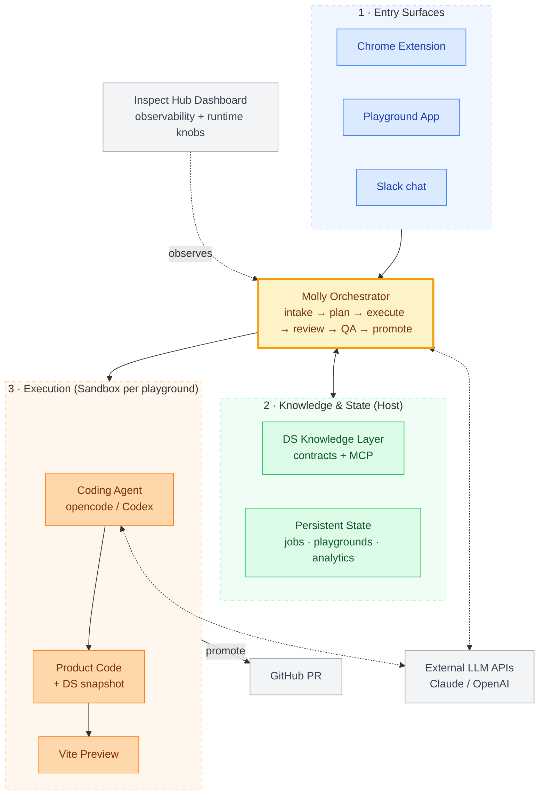
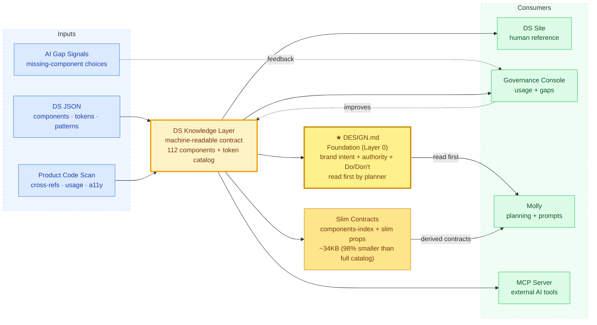

# Moloco Inspect — Progress Update & Direction (May 2026)

> **Audience:** VP Product, AI Experiences and Transformation + product designer
> **Meeting:** Design Tooling (30 min)
> **Pre-read prepared:** May 13, 2026
> **Author:** Kyungjae Ha

---

## Executive Framing — Read this first

### What this is
Inspect started as Design Tooling — a system that lets PMs, SAs, and engineers modify live product UI through natural language, see a working preview, and ship a PR. Phase 1 has been operational end-to-end for seven weeks (planned 70 days, delivered in 18). The work has expanded into two patterns worth noting: a design system that has evolved into a **machine-readable knowledge layer for AI agents**, and a **multi-agent orchestration pattern (Molly)** behind the UI changes.

### What is already working
- Phase 1 pipeline operational end-to-end (planned 70 days, delivered in 18).
- Three role-specific entry surfaces (Chrome extension, Playground, Slack) on a shared orchestrator.
- DS knowledge layer: 112 components, token catalog across 13 categories, cross-references + usage telemetry auto-extracted from ~3.6K TS/TSX source files.
- Governance console live (usage insights + anomaly callouts + shared sink for unresolved-component choices).
- MCP server: any AI tool (Claude Code, Cursor) can query the same knowledge.
- Cost predictable at PoC scale (~$50–100/month).

### What this is built around
- **The design system as AI knowledge layer** — the structured contract, not the documentation site, is what makes an LLM useful in a domain. Built this way intentionally.
- **A domain-independent orchestration shape** — plan → gate → execute → review → QA → gate → promote, designed not to be bound to UI specifically.
- **Designed-in governance** — sandbox isolation, two human gates, escalation sink, governance console were design decisions made alongside the system.

### What remains uncertain
- **Trial signal** — small-team trial starts this week; first real usage data is the Phase 2 gating event.
- **Scale** — governance and cost not yet stress-tested at 5+ concurrent users.
- **Generalization** — the pattern *should* work outside UI code; this has not been tested.
- **Closed-loop self-improvement** — vision needs data infrastructure that is not yet built.

### What discussion is needed
1. **Second-instance candidate.** If the pattern generalizes, applying to an MA team or MSM team product feels like the natural next step. Which would be most useful?
2. **Designer role evolution.** With the agent handling routine changes, how should the designer's role get defined and evolve?
3. **A note on Slingshot.** Two patterns from this work — DS as AI knowledge layer, and Molly as a domain-independent orchestration shape — may be relevant to Slingshot's broader workstreams. Curious how you see them potentially contributing.

For the full architecture, pipeline, risks, and timeline, see the appendix below.

---

# Appendix — Architecture, Pipeline, Risks, and Timeline

## TL;DR

I started this work as Design Tooling: a system that lets PMs, SAs, and engineers modify live product UI through natural language without going through a designer. Seven weeks in, the Phase 1 pipeline is operational end-to-end (planned 70 days, delivered in 18), and the work has expanded in two notable directions:

1. The Design System has evolved from a component library into a **machine-readable knowledge layer that an AI agent reasons over** — components, tokens, anti-patterns, cross-references, and usage telemetry are now structured artifacts an LLM can navigate.
2. The orchestrator behind the UI changes has taken the shape of a **multi-agent pattern (Molly)** — plan, decompose, execute, review, gate, promote — designed so that it is not bound to UI specifically. Whether it generalizes to other domains (data, QA, backend changes) is a hypothesis worth testing, not yet a proven claim.

Together, these intersect with several Slingshot workstreams in ways worth discussing — Agentic Platform, AI Governance, High-Value Workflows, AI Proficiency & Enablement.

---

## 1. Context and Origin

**Why this exists.** In today's AI-augmented work and development environment, the designer step in the front-end UI workflow has become a bottleneck: PM/SA describes a change → designer mocks → engineer implements → review. Even a small change ("add a column," "change wording") costs days while everything around the designer step moves faster. There was a need to address this. The premise was simple: if the AI knows the design system well enough, the PM/SA should be able to describe the change directly, see a working preview, and ship a PR — making designer involvement opt-in for cases that need design judgement, not a default gate.

**Original plan.** Phase 1 (pipeline + PoC), Phase 2 (channel expansion + deploy), Phase 3 (self-managing quality). 10-week Phase 1, 70 days to PoC.

**What actually happened.** Phase 1 core was completed in roughly 18 days. Several features originally scheduled for Phase 2–3 (Chrome extension, auto-refinement loop, documentation site, dashboard, MCP server) shipped inside Phase 1. The four weeks since have been spent expanding the design system into an ontology, building Molly's multi-agent pattern, and preparing the small-team trial.

**Status, May 13, 2026.** Operational end-to-end. Solo build to date; the small-team trial brings in the first external users next week (format still being decided). Phase 2 (external integration, evaluator separation, deploy) starts late May.

**Today vs the goal.** Through the designer-mediated flow, a small UI change like adding a column or revising copy currently takes 1–3 days. In PoC, the same shape of change has completed in under 5 minutes from first message to a PR ready for engineer review. The trial will measure whether that holds outside controlled conditions.

---

## 2. System Architecture

Three entry points, one orchestrator, one isolated sandbox per playground.



**Component roles.**

- **Surfaces (Chrome extension / Playground / Slack)** — role-specific entry points into the same pipeline. Each surface optimizes for a different cognitive mode (in-flow visual, deep-work canvas, casual async).
- **Molly** — the orchestrator. A single Node service that all three surfaces talk to. It runs the job state machine, emits plans, and routes each task through review and QA. Every state transition is persisted to disk; Molly recovers from a crash without losing in-progress work.
- **Sandbox** — one Docker container per playground. Holds a Vite dev server, a git working tree of the product repo, and the coding agent. The host repo is never modified.
- **Coding agent** — opencode or Codex, running inside the sandbox. Receives a per-task prompt plus DS context, edits code, commits.
- **DS knowledge layer** — structured contracts for every component (JSON), tokens, patterns, cross-references, usage statistics. Served to the agent at planning and execution time, and to other AI tools via an MCP server.
- **Inspect Hub Dashboard** — operational console for job tracking, diff review, Molly metrics, and runtime knobs.

**Two human gates.** A plan must be human-approved after the LLM emits it. QA pass must be human-confirmed after automated checks. Automated checks provide signal, but only human confirmation acts as a gate.

**Where the gates lead — a closed-loop vision.** The two human gates are not only safety mechanisms; they are also signal-capture points. Every plan edit, every rejection, every QA outcome, every comment pin is structured feedback about where the agent's reasoning needs to improve. The medium-term goal is to close this loop — feed the captured signal back into the planner and the reviewer so that the agent improves itself over time, without a human having to articulate the lesson explicitly. *The data infrastructure to do this reliably is not yet built; for now the signal is collected and the loop stays open.* Once the loop is closed, the gates stay in place but the human's role shifts from correcting routine mistakes to adjudicating the genuinely ambiguous cases.

**Concretely, what does "self-improvement" mean.** The near-term approach is system-level: prompt engineering tuned to recurring failure modes, RAG over the captured plan-edit and review signal, and contract additions when the agent repeatedly trips on the same anti-pattern. Model-level fine-tuning (supervised, or preference-pair / RLHF-style if the signal supports it) is a longer-term step — it requires both signal volume and a separate decision about fine-tune budget vs prompt-cache economics.

**Deployment shape.** Today, the orchestrator and the sandboxes both run on my local MacBook (Docker on macOS). Current capacity ceiling: 1–2 users at a time. The next deployment step — once the small-team trial yields enough signal — is to move both layers to GCP, which raises the ceiling to roughly 5–20 concurrent users and removes the local-machine dependency. The architecture in the diagram above does not change; only the host changes.

---

## 3. The Design System — From Component Library to AI Knowledge Layer

The design system started as a documentation site (component browser with previews, anatomy, tokens, accessibility specs) and grew into a structured, machine-readable knowledge graph.

**What is in the contract today.**

```
MCButton2
├── Category: Action
├── Variants: primary, secondary, ghost, danger
├── Props: label, onClick, disabled, loading, icon, size
├── Token references (resolved against the central token catalog):
│   ├── background → semantic.action.primary
│   ├── text       → semantic.text.inverse
│   └── radius     → radius.md
├── States: default, hover, active, disabled, loading
├── Accessibility: role, aria-disabled, keyboard behavior
├── Anti-patterns: documented in natural language
├── Cross-references:
│   ├── usedInPatterns:     ["ConfirmDialog", "FormFooter"]
│   ├── relatedComponents:  ["MCIconButton", "MCButtonGroup"]
│   └── requiredProviders:  ["MCThemeProvider"]
├── Usage stats: file_count, instance_count, stability tier
└── Documentation: rendered as the public DS site
```

Today: 112 components and a token catalog organized across 13 top-level categories (color, spacing, typography, elevation, animation, and more). Cross-references plus usage telemetry are automatically extracted from a product codebase scan covering ~3.6K TS/TSX source files (the extraction pipeline went live last week).



**Why this matters for AI.** Without the contract, an agent invents component names, hardcodes hex colors, guesses at props. With the contract, the agent uses real names (`MCButton2`), references tokens (`semantic.action.primary`), follows the actual prop API, includes the correct ARIA attributes, and respects documented anti-patterns. This is the "AI knowledge layer" claim in concrete terms.

**Foundation layer + slim contracts for the planner.** The full machine-readable contract (~500KB) stays authoritative for the documentation site, the governance console, and the MCP server. For planner-time injection into Molly the orchestrator splits the knowledge into two roles:

- **Foundation (Layer 0): `DESIGN.md`** — read first by the planner. ~11KB markdown carrying brand identity, authority hierarchy ("when sources disagree, top wins"), 16-category component index (name only), design-token summary, Do's & Don'ts, and a living-document policy. The system prompt explicitly directs the planner to read DESIGN.md before the structured contracts below — this is the CLAUDE.md / progressive-disclosure foundation pattern (always-on, framing the rest).
- **Derived slim contracts** — `components-index.json` (~22KB; name, importStatement, category, status only) and a slimmed `component-props.json` (description + meta stripped, `| undefined` removed; ~200KB → ~100KB). `patterns.json`, `api-ui-contracts.json`, and `pm-sa-request-schema.json` pass through unchanged.

Per-component `when_to_use` / `do_not_use` / `antiPatterns` are kept *out* of the planner's system block and reached only through the escalation flow (`closest_match` / `unresolved_components`) when the planner is uncertain. The full contract is unchanged; the slim view is optimized for prompt-cache economics.

Measured impact (paired smoke test, 2 PRDs): cold-start system tokens **237K → 112K (−52.6%)**, plan latency **−10% to −21%**, plan quality unchanged or slightly richer (referenced_components 5 → 6–7, escalation flow still activates correctly, no hallucinated component names). Approximately $0.35 saved per cold-start plan emission at current cache rates.

**Who maintains the contract, and how drift is caught.** The contract has two ownership layers. Auto-extracted fields are rebuilt on every product-code scan and cannot drift from the source: props are derived from TypeScript types via ts-morph, and cross-references plus usage telemetry come from the codebase scan over ~3.6K files. Design-team-authored fields (variants, anti-patterns, accessibility behavior, UX writing rules) live in JSON and are reviewed in the governance console with anomaly callouts — e.g., components marked stable but with zero usage are flagged. Drift-checking scripts (`prop-check`, `sync-check`) exist locally; the next governance step is to wire them as CI gates.

**Two consoles for the measurement-improvement loop.**

The design system is not a static document. Two operational surfaces watch it adapt and improve:

1. **DS documentation site** — the human-facing reference. Component browser with interactive prop controls, anatomy diagrams, token tables, accessibility specs, syntax-highlighted code in 5 languages, and global search.

2. **DS Governance console** (same site, separate page) — the improvement loop. Usage insights are live (per-component file count, anomaly callouts like "marked stable but zero usage"). When the AI asks for a component that does not exist in the contract, the choice is logged to a shared sink across all three entry surfaces (Extension, Playground, Slack) so it does not fail silently; surfacing this queue in the governance view is the next step.

The **Inspect Hub Dashboard** is the orchestration-side counterpart: job metrics, review pass rate, QA outcomes, per-job state, and runtime knobs. Together the two consoles measure both *what the DS looks like in use* and *how the AI performs against it*.

**MCP server.** Any AI tool that speaks the Model Context Protocol — Claude Code, Cursor, any future agent the company adopts — can query the same knowledge: component lookups, token resolution, pattern recommendations. The DS knowledge layer is consumable not just by this pipeline but by any agent on the platform.

---

## 4. Molly — The Multi-Agent Pattern Behind the UI Changes

If the design system is the knowledge layer, Molly is the orchestrator that uses it — the single service that all three surfaces talk to. Beyond the running service, Molly is also a *pattern* — plan, decompose, execute, review, gate, promote — and that pattern is what turns a PRD or a one-line request into a reviewable PR.

**The pipeline, step by step.**

1. **Intake.** The user describes the change on any surface. History-aware and multi-turn: the system asks clarifying questions, accepts attached context (PRD, screenshot), and routes by intent (chat / plan / status / clarify).
2. **Plan emission + human gate.** The planner reads the request plus DS context and emits a structured plan (tasks, target route, referenced components, unresolved components). The DS context follows the foundation-first pattern (see §3) — `DESIGN.md` is injected immediately after the system prompt, framing the slim contracts (components-index, slim component-props, patterns, api-ui-contracts) that follow. The static prefix uses a one-hour prompt cache to keep cost predictable. The user must approve, edit, or reject the plan before anything executes.
3. **Decompose and execute.** The plan is broken into atomic tasks, each one a single agent call producing one git commit. The coding agent runs inside the sandbox with DS context and (optionally) a pre-flight research bundle gathered by parallel read-only agents.
4. **Per-task review + QA.** Claude reviews each diff against the task description (pass / fail), then picks a QA strategy (`final_route_smoke`, `lint_only`, `human_only`, others) based on the change shape and runs it against the sandbox.
5. **Human QA gate → promote.** Even if automated QA passes, the human must explicitly confirm before the job becomes `complete`. Promote opens a PR against the real product repo.

**Where this could generalize.**

- Steps 1–5 are not specifically tied to UI work — they describe a shape (plan, decompose, execute, review, gate, promote) that *could* apply to any domain where an AI agent makes controlled, reviewed changes to a system of record: data pipelines, QA test authoring, backend handlers, infrastructure config. This has not been tested outside design.
- The two human gates and sandbox isolation are designed as domain-agnostic governance primitives — but their fit in non-UI domains is also untested.
- The DS knowledge layer could be a special case of a broader pattern: a structured, machine-readable contract over the domain. Other domains have analogous artifacts — entity schemas for data, API contracts for backend, test scaffolding libraries for QA. Whether the orchestrator primitives transfer with comparable quality is what a second-instance experiment would tell.

---

## 5. Surfaces and Use Cases

Three surfaces share a single orchestrator and a single intake protocol. The point is not that there are three UIs; it is that the same pipeline is reachable from whatever context the user is already in.

| Surface | Primary user | Work context | Typical use case |
|---|---|---|---|
| **Chrome Extension** | PM, SA | In-flow, visual | Inspecting a live product page, clicking the exact element, describing the change in one sentence. *"Add a Used Amount column to this table."* |
| **Playground App** | PM, SA, designer, engineer | Deep work | PRD-sized changes with multi-task plans, plan editing, comment pins on the preview, iterative refinement. |
| **Slack** | Anyone | Casual, async | One-off *"@molly please update the empty-state copy on the X page"* requests; thread-based clarification; result delivered as a PR link. |

The role-specificity is real. A PM in a meeting wants to point at something and describe it (Chrome extension). A PM writing a PRD wants a canvas to refine over time (Playground). An engineer or analyst with a small ask does not want to open a separate tool (Slack). The same orchestrator handles all three because the intake protocol is shared.

**A note on Figma.** The organization maintains a Figma library for the design system, but it has drifted out of sync with the codebase over time. For code-grounded component-level changes, the operational source of truth is now the DS contract plus the live preview that any plan produces. Figma remains valuable for early ideation, net-new patterns, and the design-first explorations that happen before a contract exists. What shifted is the path for committed component-level work: it grounds in the contract, not in the mock. The three operational roles Figma played for the team for code-grounded work are absorbed by the Playground:

- *Visual confirmation of a proposed change* — every plan produces a live preview running on real product code, not a mock.
- *Exploratory spreading-out of options* — alternative plans can be opened side by side and compared on the actual route.
- *Team communication anchored to a specific design* — comment pins on the running preview, plus shareable playground links any teammate can open to see the same state and continue the conversation in context.

Net-new patterns, early-stage exploration, and design-system evolution still live in Figma. What shifted is just the final-mile path for committed component-level changes — that path now grounds in the contract and the live preview, which closes the historical drift gap between mocks and shipped code.

---

## 6. The Reframe — What This Turned Out to Be

**Insight 1 — The design system is an AI knowledge layer.**
The structured contract — not the documentation site — is what makes an LLM useful in a domain. Concrete evidence: the escalation flow (when the agent needs a component that does not exist in the contract) activates cleanly, agents generate real import paths and real prop names, and smoke tests show zero hallucinated component names. Without the contract, every agent reinvents the same wrong assumptions; with it, the agent reasons over real names, real APIs, real anti-patterns.

**Insight 2 — The orchestration pattern may be domain-independent (untested outside design).**
Plan → human gate → decompose → execute → review → QA → human gate → promote is a shape designed not to be UI-specific. The sandbox + git + LLM-review primitives are not design-bound; anything that needs an AI to make controlled changes to a system of record could in principle use this shape. The shared intake protocol — the part that lets the same pipeline be reached from Slack, the extension, or the Playground — keeps adding new surfaces cheap once the protocol is stable. Whether the orchestration generalizes is what a second-instance experiment would tell — currently untested.

**Insight 3 — Governance was designed in from day one.**
The artifacts already exist: sandbox isolation (host repo never modified), two human gates (plan approval + QA confirmation), escalation sink shared across all three surfaces, governance console live in the DS site, and runtime knobs with measured defaults. These were design decisions made alongside the rest of the system, not afterthoughts. Doing this from the start was modest in cost; doing it after the fact would have been high cost and in some cases unrecoverable. The governance has not yet been stress-tested at scale — that is what the trial measures, not a current claim.

---

## 7. Alignment with Slingshot

The four Slingshot workstreams map closely to capabilities the Inspect work has already exercised.

**Slingshot 1 — Agentic Platform (Speedboat as one-stop shop).**
Molly is a working reference implementation of multi-agent orchestration on top of LLMs: planner, executor, reviewer, QA strategist, and the bundling primitives that hold them together. The patterns (intake protocol; plan-approve-execute-gate; sandbox per playground; MCP-served knowledge layer) are extractable as skills and plugins that could be contributed back to Speedboat. The DS MCP server is itself a candidate plugin: any agent on Speedboat could query design system knowledge through the same protocol.

**Slingshot 2 — AI Governance (guardrails, environment, processes).**
Pieces already in production:

- Sandbox isolation per playground (host code never touched)
- Two human gates (plan approval + QA pass)
- A shared sink that logs unresolved-component choices across the three entry surfaces (queued for the next governance view rather than silently dropped)
- A governance console with live usage insights and anomaly callouts
- Explicit runtime knobs for research parallelism with measured-default tradeoffs
- Per-job state persisted to disk for auditability

A concrete case study for the governance workstream — though most of the pieces are still being stress-tested in the trial.

**Slingshot 3 — High-Value Workflows (function-level impact).**
The PM/SA UI-change workflow is a clean high-value workflow: well-bounded task, measurable cycle-time delta (designer-mediated days → minutes-to-PR), measurable quality (TypeScript check, lint, QA strategy, engineer review pass rate). It is also a beachhead for adjacent workflows: copy/UX writing, accessibility audits, layout polishing — all share the same pipeline shape.

**Slingshot 4 — AI Proficiency & Enablement (role-specific learning journeys).**
Three surfaces are already role-specific entry points. The DS site doubles as a learning artifact — someone new to the design system can browse it interactively. The playground itself is a teaching tool: users see the agent's plan, watch it execute step by step, see the diff, see the QA result.

---

## 8. Where This Could Go

Three directions feel concrete enough to discuss.

**(a) Across products.** Point the same pipeline at any product with a DS contract. Marginal cost is one-time contract extraction.

**(b) Across domains (the next logical experiment).** The orchestration pattern is not bound to UI code, though I have not yet pointed the pipeline at a non-UI domain. Candidates with the same shape:

- **Data pipeline changes** — entity schemas + transformation logic. The "DS contract" becomes the entity catalog.
- **QA test authoring** — test patterns + assertion library.
- **Backend handler edits** — API contracts + service boundaries (OpenAPI + service catalog).
- **Internal tooling / admin UIs** — CRUD patterns.

Each needs its own domain contract plus adapters (sandbox, QA, promotion path) — the orchestrator, planning, review, and gating primitives are reusable across them.

And the risk profile is domain-specific — UI changes tend to fail visibly while backend or data changes can fail silently. Each adapter calibrates QA strictness accordingly: UI uses automated checks plus human visual confirmation; backend / data adapters would need integration tests, performance assertions, and data-quality gates on top.

**(c) As Speedboat contributions.** The intake protocol, the plan-execute-review-gate pattern, the sandbox primitive, and the MCP-served knowledge layer are each candidates to be packaged as Speedboat skills or plugins.

---

## 9. Risks and Unsolved Problems

Being explicit about what is not yet solved.

- **API cost at scale.** PoC cost ~$50–100/month; Phase 2 estimate ~$200–400/month at small-team scale. Per-request parallelism cost is measured (P=1–5 sweep, where P is the number of pre-flight context agents per task) with a defensible default (P=5); cost at 5+ concurrent users is not yet measured.
- **Multi-page consistency.** The agent works per-page. Cross-page operations ("rename this concept everywhere it appears") are not yet first-class. Planned for Phase 2.
- **PRD parsing accuracy.** Formats vary across teams; parsing degrades on non-standard inputs. Phase 2 sub-item.
- **Coverage gap.** The shared-component layer has high coverage; the 1,320 app-level files lack structured contracts. The agent sees them but does not reason over them with the same power. Addressed incrementally; full coverage is long-term.
- **Governance edge cases.** Today's escalation handles missing components but not subtler cases (a component used outside its intended pattern; unrecognized anti-pattern violations). Follow-up work is scoped but not yet built.
- **Concurrent code writing.** Current parallelism gathers *context* in parallel; writing *code* in parallel across tasks is a separate, research-only question — merge-and-conflict cost vs latency saving.
- **What would prompt a rethink:**
  - Review pass rate *sustained* below ~50% after iteration (an initial low number is fine — it is the lack of improvement that matters)
  - Users dropping off after the first session
  - Cost outliers that do not track with usage
  - Governance escapes — anti-pattern code passing both human gates

---

## 10. Next 8 Weeks

| Period | Focus |
|---|---|
| **Now (W1–3)** | Small-team trial runs; first real usage data. In parallel: automatic DS request draft / issue creation for components the AI asks about but that do not yet exist; quality measurement on the parallel pre-flight context feature. |
| **Mid-June (W4–6)** | Phase 2 starts — deeper external integration (Slack threads, Jira tickets, richer PRD parsing). Generator and evaluator agents split into separate roles so the agent producing the diff is not the one grading it. |
| **Early July (W7–8)** | Server deployment and QA. Demo and onboarding for the first internal pilot team. |

The small-team trial is the gating event. Real usage data on real PRDs is what tells whether the pipeline is ready to widen, and whether the cost-and-quality tradeoffs hold up outside controlled testing.

**Trial targets** (aspirational; not yet measured):

| Metric | Target |
|---|---|
| Time to PR for simple changes | under 5 minutes from first message |
| Average request-to-preview latency | 1–3 minutes |
| PM independence (no designer needed for the request) | 3 of 4 participants |
| DS compliance (real tokens and component APIs used) | 80%+ |
| Engineer review pass rate on first attempt | 70%+ |
| Engineer review effort per AI-PR | ≤ baseline for human-authored PRs (no fatigue tax) |

They serve as the read-out for whether to move toward broader rollout or iterate further on the pipeline. These are stretch targets — an initial read at, say, ~50% first-attempt review pass rate is worth iterating on, not a failure mode. The rethink trigger (§9) is *sustained* underperformance after iteration, not the first read.

---

## 11. Three Threads for the Conversation

**(a) Trade-off between depth and Slingshot integration.** Phase 2 work (external integration, evaluator separation, deploy) and any Speedboat / Slingshot integration both have meaningful pull on the next quarter. Where does the right trade-off sit — finish Phase 2 first and absorb into Slingshot later, or pause Phase 2 to integrate now? The four-workstream mapping in §7 is real, but the *sequencing* is genuinely uncertain.

**(b) Cross-team second instance.** If the orchestration pattern generalizes, the choice of the second domain (data, QA, backend, admin tooling, or something else) matters more than the abstract argument. The contract-extraction cost is the rate-limiter, so picking the right next instance is high-leverage. Live discussion will be more productive than written speculation.

**(c) Designer involvement.** If the agent handles common changes, where would the design team most want to be looped in earlier — pattern evolution, anti-pattern policing, UX writing tone, accessibility audits — versus where would they be glad to be unblocked from routine work?

