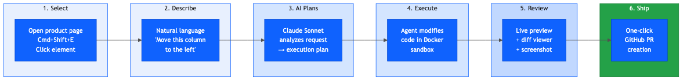
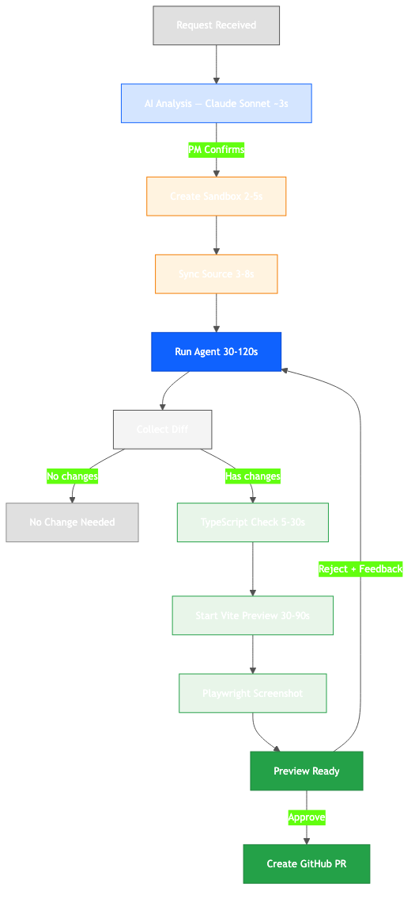
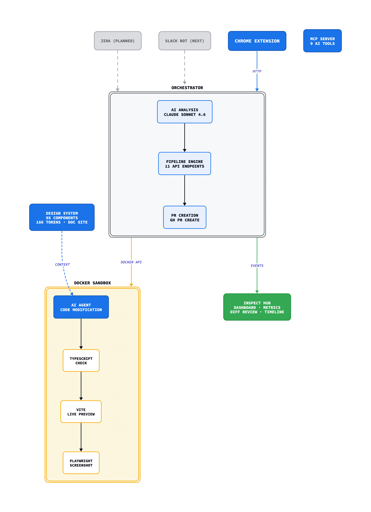
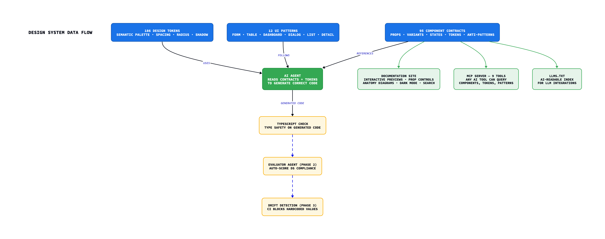

# Moloco Inspect — Design Agent Progress Report

> An AI agent that lets PMs, SAs, and engineers modify live product UI through natural language — no designer required.

**Kickoff:** March 26, 2026 | **Updated:** April 14, 2026 (Day 19)
**Author:** Kyungjae Ha
**Status:** Phase 1 core complete in ~18 days vs. planned 70 days (4×). Stability & Polish in progress.
**Repository:** https://github.com/kyungjaeha-moloco/moloco-inspect

---

## 1. Executive Summary

The Design Agent system is now **operational end-to-end**. A PM or SA can open a live product page, select an element, describe a change in natural language, and receive an AI-generated code modification — complete with live preview, syntax-highlighted diff review, and one-click PR creation.

Phase 1 scope was completed in ~18 days against a planned 70-day (10-week) schedule. Several Phase 2–3 features (Chrome Extension, auto-refinement loop, design system documentation site, Inspect Hub dashboard) have already been delivered.

---

## 2. How It Works: End-to-End Flow



### Step 1 — Select an Element
PM opens a live product page (e.g., TAS Order Management) in Chrome. Presses `Cmd+Shift+E` to activate the inspector. Clicks to lock the selection.

**What the system captures automatically:**
- React component name (e.g., `MCOrderListTableContainer`)
- Source file path and line number
- Test ID (`data-testid`)
- Computed styles (font size, color, padding, dimensions)
- Page route (e.g., `/v1/p/TVING_OMS/oms/order?type=available`)
- Client context (tving, shortmax, etc.)

### Step 2 — Describe the Change
In the Chrome Extension side panel, the PM describes what they want in natural language:

> "Add a 'Used Amount' column to this order table"

Or for more complex requests:
- Attach a **PRD link** for context-aware changes
- Use **structured request mode** with clarification options
- **Multi-select** elements (Shift+Click) for changes spanning multiple components

### Step 3 — AI Plans the Change
Claude Sonnet 4.6 analyzes the request and returns a structured execution plan:

```
┌─────────────────────────────────────────────────┐
│  Inspect Agent — Request analyzed                │
│                                                  │
│  Understanding:                                  │
│  You want to add a "Used Amount" column to the   │
│  order list table.                               │
│                                                  │
│  Steps:                                          │
│  1. Find MCOrderListTableContainer.tsx           │
│  2. Add column definition { id: 'usedAmount' }  │
│  3. Update the data accessor                     │
│  4. Add i18n key for column header               │
│  5. Run typecheck to verify                      │
│                                                  │
│  Risks: Column width may need adjustment         │
│                                                  │
│  [Proceed with this plan]  [Adjust the plan]     │
└─────────────────────────────────────────────────┘
```

### Step 4 — Agent Executes in Sandbox



- Full product repo copy inside a Docker container
- Claude Sonnet modifies the code (30s–2min depending on complexity)
- TypeScript typecheck runs automatically
- Vite dev server starts for live preview
- Screenshot captured via Playwright

**Key safety feature:** The host codebase is never modified. All changes happen inside the sandbox. If something goes wrong, the container is deleted — zero impact.

### Step 5 — PM Reviews

The Inspect Hub dashboard shows the result with:
- **AI Analysis** — understanding, approach, steps, risks, verification
- **Live Preview** — the actual modified page running in the browser
- **Inline diff** — syntax-highlighted code changes with +/- counts
- **Screenshot** — visual capture of the modified page
- **Changed files** — list of modified files as chips

```
┌─────────────────────────────────────────────────────────────────┐
│  ← Requests    ● preview · 1:23 · tving · /oms/order          │
│                                                                 │
│  "Add a Used Amount column to the order list table"            │
│                                                                 │
│  ┌─────────────────────┬───────────────────────────────────┐   │
│  │ Agent Analysis       │ Preview                           │   │
│  │ Understanding:       │ [████ Open Live Preview ████]     │   │
│  │ Steps: ①②③④⑤        │ [Screenshot] + changed files      │   │
│  │ ⚠ Risks             │                                   │   │
│  └─────────────────────┴───────────────────────────────────┘   │
│                                                                 │
│  Code Changes                                  +12 -3  3 files │
│  ▾ diff --git a/MCOrderListTableContainer.tsx                  │
│  + { id: 'usedAmount', Header: t('table.usedAmount') }        │
│                                                                 │
│  ▾ Timeline (12 events)                                         │
│  ━━━━━━━━━━━━━━━━━━━━━━━━━━━━━━━━━━━━━━━━━━━━━━━━━━━━━━━━━━━  │
│  [✓ Approve & Create PR]  [Request Changes]  [Live Preview ↗]  │
└─────────────────────────────────────────────────────────────────┘
```

### Step 6 — Ship
On "Approve", the orchestrator creates a git branch, applies the diff, commits, and creates a GitHub PR via `gh pr create`. The engineer reviews and merges through the normal process.

On "Request Changes", the PM enters feedback and the agent iterates (up to 3 rounds).

---

## 3. System Architecture



### Pipeline Stages (with timing)

| Stage | What Happens | Duration |
|-------|-------------|----------|
| `creating_sandbox` | Docker container created with port allocation | 2–5s |
| `syncing_source` | Product repo copied into sandbox | 3–8s |
| `starting_agent` | OpenCode server boots inside sandbox | 2–4s |
| `running_agent` | Claude Sonnet modifies code | 30–120s |
| `collecting_diff` | `git diff` extracted from sandbox | 1–2s |
| `validating` | TypeScript typecheck (`tsc --noEmit`) | 5–30s |
| `capturing_screenshot` | Playwright captures the modified page | 3–5s |
| `starting_preview` | `pnpm install` + `vite --mode test` | 30–90s |
| `preview_ready` | Live preview URL available for PM review | — |

### Security
- **Sandbox isolation** — All code modifications in Docker containers. Host repo never modified.
- **Shell injection prevention** — PR body via `--body-file`, not shell interpolation.
- **Auth bypass scope** — Token injection only in sandbox vite, not production.

---

## 4. Design System



### What Is It?
A structured, machine-readable specification of all UI components. The "rulebook" the AI agent follows when generating code.

### Component Contract Example

```
MCButton2
├── Category: Action
├── Variants: primary, secondary, ghost, danger
├── Props: label, onClick, disabled, loading, icon, size
├── Tokens:
│   ├── background → semantic.action.primary
│   ├── text → semantic.text.inverse
│   └── border-radius → radius.md
├── States: default, hover, active, disabled, loading
├── Accessibility:
│   ├── role: button
│   ├── aria-disabled: when disabled
│   └── keyboard: Enter/Space to activate
├── Anti-patterns:
│   └── "Don't use ghost variant for primary actions"
├── Usage count: 342 instances
└── Adoption rate: 89%
```

### Why This Matters

| Without Design System | With Design System |
|----------------------|-------------------|
| Agent invents component names | Uses real names (`MCButton2`, `MCTable`) |
| Hardcodes colors `#0f62fe` | Uses tokens `semantic.action.primary` |
| Unknown props and states | Knows exact props, variants, valid states |
| No accessibility awareness | Includes ARIA attributes and keyboard behavior |
| Inconsistent patterns | Follows documented combination patterns |

### Documentation Site

Carbon Design-style site with:
- **Interactive previews** — Change props in real-time (Mantine-style)
- **Anatomy diagrams** — Visual breakdown of component structure (Radix-style)
- **Code examples** — Shiki syntax highlighting (5 languages)
- **Style tab** — Token mapping tables
- **Accessibility tab** — ARIA specs, keyboard behavior
- **Dark mode** + **⌘K global search**

### MCP Server (9 tools)

Any AI tool (Claude Code, Cursor, etc.) can query components, tokens, and patterns via the MCP server.

---

## 5. What Changed from the Original Plan

### Entry Point: Slack → Chrome Extension

| Factor | Slack (text-only) | Chrome Extension (visual) |
|--------|-------------------|--------------------------|
| Element identification | Describe in words | Click the exact element |
| Visual context | None | Component hierarchy, styles, DOM |
| User cognitive load | High | Low — see it, click it, describe it |
| AI output quality | Lower (ambiguous) | Higher (precise targeting) |
| Iteration speed | Slow (clarify in thread) | Fast (unambiguous from start) |

**Decision:** Chrome Extension first → Slack next → Jira later.

### Phase 1 Scorecard

| Original Target | Actual | Status |
|-----------------|--------|--------|
| 20 components | **95 components** + tokens + MCP + doc site | ✅ 4.75× |
| Slack → Agent → PR | Extension → Sandbox → Preview → Diff → PR | ✅ Complete |
| Staging URL preview | Live preview (sandbox vite + auth bootstrap) | ✅ Complete |
| Rule-based evaluator | TypeScript check + AI analysis + manual review | ✅ Complete |

### Features Delivered Ahead of Schedule

| Feature | Original Phase | Delivered |
|---------|---------------|-----------|
| Chrome Extension with inspector | Phase 3 | ✅ Phase 1 |
| Auto-refinement loop | Phase 2 | ✅ Phase 1 |
| Design System doc site | Phase 3 | ✅ Phase 1 |
| Inspect Hub dashboard | Not planned | ✅ Phase 1 |
| Live preview with auth | Not planned | ✅ Phase 1 |
| MCP Server (9 tools) | Not planned | ✅ Phase 1 |
| Inline diff + approve/reject | Not planned | ✅ Phase 1 |

---

## 6. What Types of Requests Work

### Works Well Now ✅

| Type | Example |
|------|---------|
| Add/remove table columns | "Add a Used Amount column" |
| Change button labels/text | "Change 'Submit' to 'Confirm Order'" |
| Modify spacing/padding | "Add more space between these cards" |
| Swap components | "Replace this dropdown with a radio group" |
| Simple layout changes | "Move this section above the table" |
| Add form fields | "Add an email input to this form" |
| Status text changes | "Change the error message to be more specific" |

### Needs Improvement 🟡

| Type | Challenge |
|------|-----------|
| PRD-based changes | PRD format varies; parsing accuracy needs work |
| Multi-page changes | Agent works per-page; cross-page consistency not guaranteed |
| Complex state logic | Event handlers with API calls need careful context |

### Not Supported Yet ❌

| Type | Phase |
|------|-------|
| Completely new page layouts | Phase 2 |
| Drag-and-drop interactions | Phase 3 |
| New components not in DS | Requires designer |
| Deep accessibility audits | Phase 3 |

---

## 7. Milestones & Roadmap (M1–M16)

### Phase Objectives

| Phase | Question | Focus |
|-------|----------|-------|
| **Phase 1** | "Does it work?" | Pipeline verification + PoC |
| **Phase 2** | "Can the team use it?" | Channel expansion + Quality automation + Deploy + Training |
| **Phase 3** | "Does it run itself?" | Self-managing quality + Production hardening |

### Timeline (Target: August 15, 2026)

| Phase | # | Milestone | Duration | Target | Status |
|-------|---|-----------|----------|--------|--------|
| **Phase 1** | | **"Does it work?"** | | | |
| *Pipeline* | M1 | Context Layer (95 components, tokens, patterns) | — | — | ✅ Done |
| | M2 | Agent Pipeline (sandbox → code → validate → preview → PR) | — | — | ✅ Done |
| | M3 | Chrome Extension (inspector, capture, AI analysis) | — | — | ✅ Done |
| | M4 | Design System Site (Carbon-style, previews, dark mode, search) | — | — | ✅ Done |
| | M5 | Inspect Hub Dashboard (tracking, diff, approve/reject, metrics) | — | — | ✅ Done |
| *PoC* | M6 | Stability & Polish | 2w | Apr 14 – 25 | 🔵 In progress |
| | M7 | User Testing (PM 2, Eng 1, SA 1) | 2w | Apr 28 – May 9 | ⬜ |
| | M8 | PoC Report & Go/No-Go | 1w | May 12 – 16 | ⬜ |
| | | *Buffer — PoC feedback incorporation* | *1w* | *May 19 – 23* | |
| | | | | | |
| **Phase 2** | | **"Can the team use it?"** | | | |
| *Channel Expansion* | M9 | External Integration (Slack + Jira + PRD parsing) | 4w | May 26 – Jun 20 | ⬜ |
| *Quality Automation* | M10 | Evaluator Separation (Generator vs Evaluator) | 1.5w | Jun 23 – Jul 2 | ⬜ |
| *Deploy & Rollout* | M11 | Server Deploy & QA | 1w | Jul 3 – 9 | ⬜ |
| | M12 | Demo, Onboarding & Rollout | 1.5w | Jul 10 – 18 | ⬜ |
| | | | | | |
| **Phase 3** | | **"Does it run itself?"** | | | |
| *Self-managing Quality* | M13 | Visual Regression — Eng | 1.5w | Jul 21 – 30 | ⬜ |
| | M14 | Copy Agent — Designer | 1.5w | Jul 21 – 30 (parallel) | ⬜ |
| | M15 | Doc Maintainer (auto-update context) | 1w | Jul 31 – Aug 6 | ⬜ |
| *Production Hardening* | M16 | Production Hardening | 1.5w | Aug 7 – 15 | ⬜ |

### Visual Timeline

```
Apr          May              Jun              Jul              Aug
├────────────┼────────────────┼────────────────┼────────────────┼───────┤

Phase 1 ━━━━━━━━━━━━━━━━━━━━━━━━━━━━━━
 M1-M5                 ✅ Done
 M6 Stability  ████████
 M7 Testing           ████████
 M8 Report                    ████
 Buffer                           ████

Phase 2 ━━━━━━━━━━━━━━━━━━━━━━━━━━━━━━━━━━━━━━━━━━━━━━━━
                                       M9  Integration  ████████████████
                                       M10 Evaluator                    ██████
                                       M11 Deploy                             ████
                                       M12 Rollout                               ██████

Phase 3 ━━━━━━━━━━━━━━━━━━━━━━━━━━━━━━━━━━━━━
                                                                          M13 Visual  ██████ ┐
                                                                          M14 Copy    ██████ ┘ parallel
                                                                          M15 DocMaint       ████
                                                                          M16 Prod               ██████

                                                                                              Aug 15 ← Complete
```

### Checkpoints

| Gate | Date | Decision |
|------|------|----------|
| **Phase 1 → Buffer** | May 16 | PoC success criteria met → Go/No-Go |
| **Buffer → Phase 2** | May 26 | Feedback incorporated → Phase 2 begins |
| **Phase 2 → 3** | Jul 18 | Team actively using, deployed & trained |
| **Phase 3 Complete** | Aug 15 | Self-managing quality + production stable |

---

## 8. Milestone Details

### M6. Stability & Polish (Apr 14 – 25)

| Task | Solution | Priority |
|------|----------|----------|
| Live Preview auth | Inject auth tokens into sandbox `index.html` before vite starts | P0 |
| Screenshot capture | Playwright captures after vite is ready | P1 |
| State persistence | File-based (`state/{id}.json`), restore on startup | P1 |
| Sandbox cold start | Pre-bake `node_modules` into Docker image | P2 |
| AI prompt quality | Intent-specific few-shot examples | P2 |

### M7. User Testing (Apr 28 – May 9)

**4 participants** (2 PM, 1 Eng, 1 SA) × **5 tasks** on TAS Order Management

| Metric | Target |
|--------|--------|
| PM independence (no designer) | 3 of 4 |
| Time to PR | < 5 min |
| DS compliance | 80%+ |
| Engineer review pass | 70%+ |
| Satisfaction | 3.5/5+ |

### M9. External Integration (May 26 – Jun 20)

| Week | Focus | Deliverable |
|------|-------|-------------|
| 1 | Slack | `@design-agent` mention, thread-based request/response |
| 2 | Jira | Webhook, ticket detection, proposal comment |
| 3 | Jira + PRD | Ticket→PR link, PRD basic parsing |
| 4 | Integration QA | 3-channel end-to-end testing |

### M10. Evaluator Separation (Jun 23 – Jul 2)

| Dimension | Check | Example |
|-----------|-------|---------|
| Token compliance | Rule | No hardcoded `#ffffff` → `semantic.background.base` |
| Component API | Rule | Unknown props rejected |
| Import paths | Rule | No cross-boundary imports |
| Layout patterns | Rule + LLM | 4/8/12/16/24px spacing scale |
| Accessibility | Rule | `aria-label` on interactive elements |

### M11–M12. Deploy & Rollout (Jul 3 – 18)

Docker Compose deployment → 10 end-to-end QA scenarios → 30-min CAS team demo → 1:1 onboarding → Quick Start guide → `#cas-design-agent` Slack channel

### M13–M14. Quality Agents (Jul 21 – 30, parallel)

- **M13 Visual Regression** (Engineer) — Playwright screenshot diff, auto-detect regressions
- **M14 Copy Agent** (Designer) — UX writing: tone & voice, terminology, multilingual (ko/en/ja)

### M15–M16. Self-managing System (Jul 31 – Aug 15)

- **M15 Doc Maintainer** — PR merge → auto-update Context Layer. Drift detection in CI.
- **M16 Production Hardening** — Monitoring, error recovery, backup, uptime alerting.

---

## 9. Cost & Infrastructure

| Item | Current (PoC) | Phase 2 Estimate |
|------|--------------|-----------------|
| AI API (Anthropic) | ~$50–100/month | ~$200–400/month |
| Infrastructure | Local Docker (zero) | Docker Compose on team server |
| GitHub | Existing org account | Same |
| Additional | None | Slack app hosting (minimal) |

---

## 10. Key Numbers

| Metric | Value |
|--------|-------|
| Components in Design System | 95 |
| Design tokens | 186 |
| Pipeline stages | 9 |
| API endpoints | 11 |
| MCP Server tools | 9 |
| Avg request-to-preview | 1–3 minutes |
| Auto-refinement rounds | Up to 3 |
| Sandbox isolation | Docker container per request |
| Development speed | 4× faster than planned |

---

## 11. Key Takeaways

1. **Visual context is king.** Chrome Extension's element capture dramatically outperforms text-only Slack descriptions.
2. **Context Layer investment paid off.** 95 components → agent rarely suggests wrong components or props.
3. **Sandbox isolation is essential.** Zero risk to host codebase. Failed experiments simply deleted.
4. **The review flow matters as much as generation.** Live preview + inline diff + approve/reject made the system usable by non-engineers.
5. **Auto-refinement closes the gap.** 2–3 feedback iterations typically reach an acceptable result.

---

## 12. Repository Structure

```
moloco-inspect/
├── chrome-extension/      Chrome Extension (inspector, side panel)
├── orchestrator/          Pipeline server (Node.js)
├── sandbox/               Docker image for isolated execution
├── dashboard/             Inspect Hub (React dashboard)
├── design-system/         95 component JSON contracts + tokens
├── design-system-site/    Documentation site (Carbon-style)
├── design-system-mcp/     MCP server for AI tool integration
├── tooling/               Sandbox manager, preview utilities
└── docs/                  Architecture docs, handoffs, proposals
```
