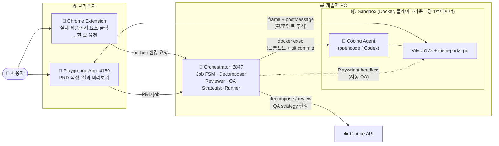
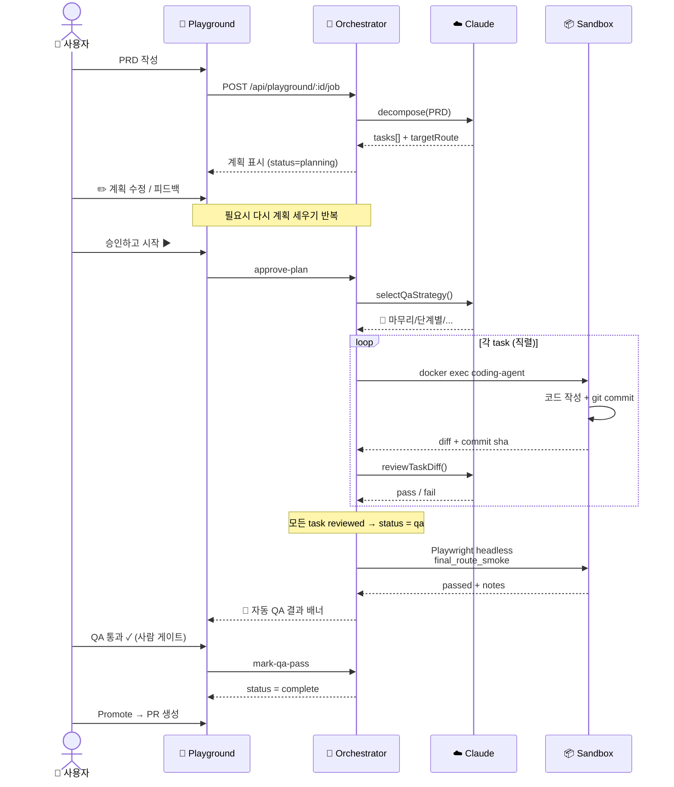

# Moloco Inspect — 시스템 구조 개요 / System Overview

> **What this is.** Inspect 는 PM/SA가 자연어로 UI 변경을 요청하면 LLM 코딩 에이전트가
> 실제 제품 코드(msm-portal)를 격리된 샌드박스에서 수정·커밋하고, 결과를 브라우저 미리보기로
> 보여주는 시스템입니다.
>
> 사용자는 두 개의 입구를 통해 작업을 시작할 수 있습니다:
> 1. **Chrome Extension** — 실제 운영 화면 위에서 요소를 클릭해 한 줄 요청 ("이 버튼 색 바꿔줘")
> 2. **Playground App** — PRD 단위의 다단계 계획 → 직렬 실행 → 자동 QA → PR Promote

---

## 1. 시스템 구조 (한 장)

### 컴포넌트 역할 / Component roles

| 컴포넌트 | 역할 |
|---|---|
| **Chrome Extension** | 실제 운영 페이지(예: TAS Dashboard) 위에 사이드패널을 띄워, 사용자가 요소를 클릭하고 자연어로 변경 요청을 보낼 수 있게 하는 입구. |
| **Playground App** | Vite/React 기반의 작업 캔버스. PRD 입력, 계획 검토/수정, 실시간 진행 상황(에이전트가 어떤 도구를 쓰고 있는지), 결과 미리보기, 코멘트 핀, 히스토리 다이얼로그를 제공. |
| **Orchestrator** | Node :3847 의 단일 서버. 모든 요청의 입구이자 두뇌. Job FSM(상태 기계), 작업 분해, 리뷰, QA 전략 결정/실행을 모두 담당. |
| **Sandbox** | 플레이그라운드 당 1개의 Docker 컨테이너. 안에 Vite dev 서버 + msm-portal git 트리 + 코딩 에이전트가 들어 있음. 격리되어 있어 변경이 실제 prod 코드에 영향을 주지 않음. |
| **Coding Agent** | 컨테이너 내부에서 실제 코드를 작성하는 LLM 에이전트(opencode/Codex). docker exec 으로 호출되며, msm-portal 트리에 직접 git commit. |
| **Claude API** | Orchestrator 가 (1) PRD를 task로 쪼갤 때, (2) 각 task의 diff를 리뷰할 때, (3) QA 전략을 고를 때 사용. |
| **Playwright (host-side)** | Orchestrator 호스트에 설치된 헤드리스 브라우저. `final_route_smoke` QA 전략이 선택되면 샌드박스의 Vite 서버에 직접 접속해 라우트가 잘 떠 있는지(권한 가드, 콘솔 에러, 빈 화면 등) 자동 검증. |

---

## 2. PRD → 결과까지 (시퀀스)

### 핵심 원칙 / Design principles

1. **두 단계 게이트.** Decomposer 가 만든 계획은 사람이 한 번 승인해야 실행됨. QA 자동 통과 후에도 "QA 통과 ✓" 버튼은 사람이 누르는 최종 게이트.
2. **직렬 실행.** Job 안의 task 들은 한 번에 하나씩만 실행. 동일 git working tree를 공유하기 때문에 병렬은 충돌 위험. Job 간(다른 플레이그라운드)은 병렬 OK.
3. **격리.** 모든 코드 변경은 플레이그라운드 단위 Docker 컨테이너 안에서 일어남. 사람이 명시적으로 Promote 하기 전엔 prod repo 에 닿지 않음.
4. **자동 QA 는 informational.** Playwright 자동 검증이 ✅ 통과하더라도 사람이 직접 "QA 통과" 누를 때까지 status 는 `qa` 로 머묾. 자동화는 안전망이지 게이트가 아님.
5. **모든 상태는 디스크에 영속화.** Orchestrator 가 죽었다 살아나도 진행 중인 job 의 상태가 복원됨 (`orchestrator/state/jobs/*.json`).

---

## 3. 용어 / Glossary

| 용어 | 의미 |
|---|---|
| **Playground** | 사용자가 작업하는 격리된 작업 공간. 1 playground = 1 Docker container = 1 git work branch. |
| **Job** | 한 PRD에 대한 전체 작업 단위. 여러 task 로 쪼개짐. |
| **Task** | Job 안의 작은 단위 작업. 코딩 에이전트의 한 번 호출 = 한 task = 한 git commit. |
| **Decompose** | Claude 가 PRD를 task 배열로 쪼개는 단계. `targetRoute`(결과 페이지 URL)도 같이 정함. |
| **Review** | task 완료 후 Claude 가 diff 를 보고 PRD 의도와 맞는지 pass/fail 판정. |
| **QA Strategy** | Claude 가 작업 결과를 어떻게 검증할지 고른 전략 (`final_route_smoke` / `lint_only` / `human_only` / ...). |
| **Promote** | 격리된 플레이그라운드의 변경을 실제 prod repo에 PR 로 올리는 단계. |
| **Sandbox** | 코드가 실행되는 격리된 환경 (Docker 컨테이너 안의 Vite + git tree). |
| **Bridge** | Playground iframe 과 호스트 페이지 간의 postMessage 통신 레이어 (요소 picking, 코멘트 핀 추적, 라우트 nav). |

---

## 4. 더 알고 싶다면 / Further reading

- 가장 최근 작업 핸드오프: [`docs/superpowers/handoffs/2026-04-27-pipeline-polish-and-qa-strategy.md`](../superpowers/handoffs/2026-04-27-pipeline-polish-and-qa-strategy.md)
- QA 러너 설계: [`docs/superpowers/handoffs/2026-04-27-qa-strategy-runner.md`](../superpowers/handoffs/2026-04-27-qa-strategy-runner.md)
- 초기 PRD→delivery 설계: [`docs/superpowers/handoffs/2026-04-24-prd-delivery-thin-slice.md`](../superpowers/handoffs/2026-04-24-prd-delivery-thin-slice.md)

---

*마지막 업데이트: 2026-04-29*
